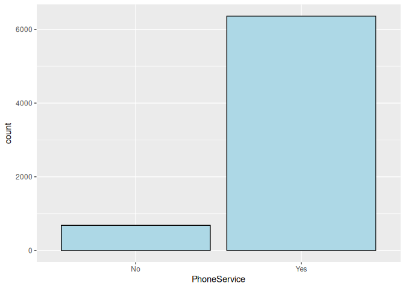
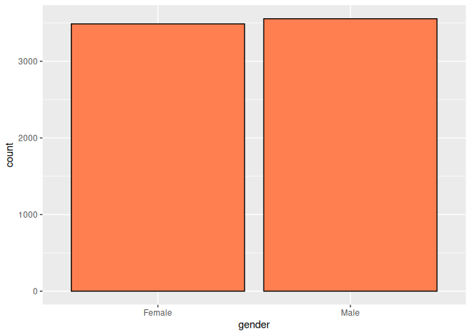
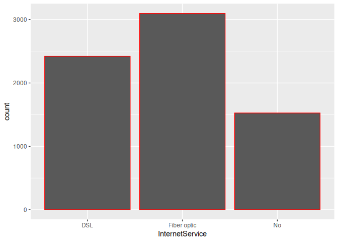
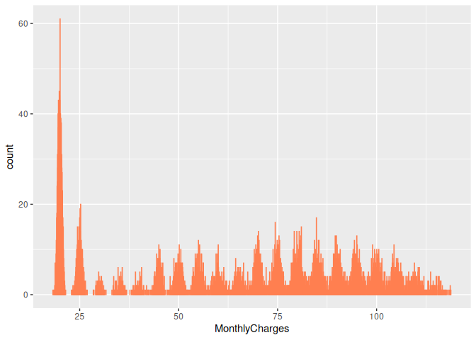
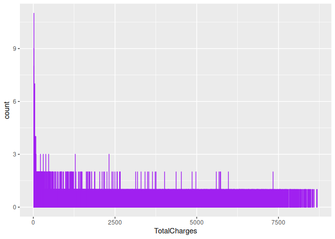
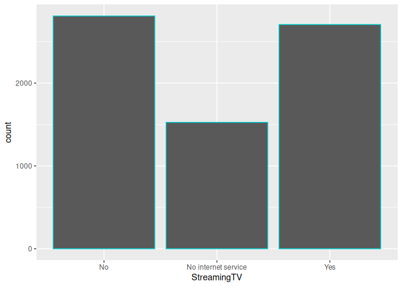
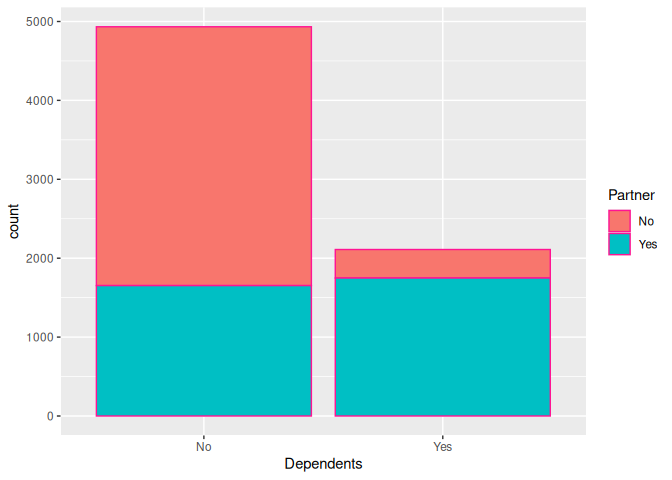

Aes Attribute in R
================
Monalisa Roy

## Read the data

``` r
customer=read.csv("customer-churn",stringsAsFactors = T)
View(customer)
```

## Install packages

``` r
library(ggplot2)
```

## Create the following bar-plot where

### PhoneService column is assigned to the x aesthetic

``` r
ggplot(data = customer,aes(x=PhoneService))+geom_bar(fill="lightblue",col="black")
```

<!-- -->

### Gender column is assigned to the x aesthetic

``` r
ggplot(data = customer,aes(x=gender))+geom_bar(fill="coral",col="black")
```

<!-- -->

### InternetService is assigned to x aesthetic and MonthlyCharges to aesthetic

``` r
ggplot(data = customer,aes(x=InternetService,fill=MonthlyCharges))+geom_bar(col="red")
```

    ## Warning: The following aesthetics were dropped during statistical transformation: fill
    ## ℹ This can happen when ggplot fails to infer the correct grouping structure in
    ##   the data.
    ## ℹ Did you forget to specify a `group` aesthetic or to convert a numerical
    ##   variable into a factor?

<!-- -->

### MonthlyCharges is assigned to x aesthetic and SeniorCitizen to aesthetic

``` r
ggplot(data = customer,aes(x=MonthlyCharges,fill=SeniorCitizen))+geom_bar(col="coral")
```

    ## Warning: The following aesthetics were dropped during statistical transformation: fill
    ## ℹ This can happen when ggplot fails to infer the correct grouping structure in
    ##   the data.
    ## ℹ Did you forget to specify a `group` aesthetic or to convert a numerical
    ##   variable into a factor?

<!-- -->

### TotalCharges is assigned to x aesthetic and tenure to aesthetic

``` r
ggplot(data = customer,aes(x=TotalCharges,fill=tenure))+geom_bar(col="purple")
```

    ## Warning: Removed 11 rows containing non-finite values (`stat_count()`).

    ## Warning: The following aesthetics were dropped during statistical transformation: fill
    ## ℹ This can happen when ggplot fails to infer the correct grouping structure in
    ##   the data.
    ## ℹ Did you forget to specify a `group` aesthetic or to convert a numerical
    ##   variable into a factor?

<!-- -->

### StreamingTV is assigned to x aesthetic and SeniorCitizen to aesthetic

``` r
ggplot(data = customer,aes(x=StreamingTV,fill=SeniorCitizen))+geom_bar(col="cyan3")
```

    ## Warning: The following aesthetics were dropped during statistical transformation: fill
    ## ℹ This can happen when ggplot fails to infer the correct grouping structure in
    ##   the data.
    ## ℹ Did you forget to specify a `group` aesthetic or to convert a numerical
    ##   variable into a factor?

<!-- -->

### Dependents is assigned to x aesthetic and Partner to aesthetic

``` r
ggplot(data = customer,aes(x=Dependents,fill=Partner))+geom_bar(col="deeppink")
```

<!-- -->
