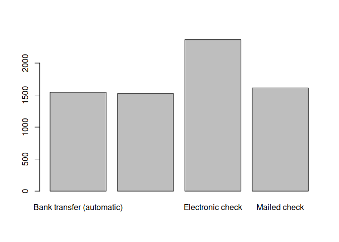
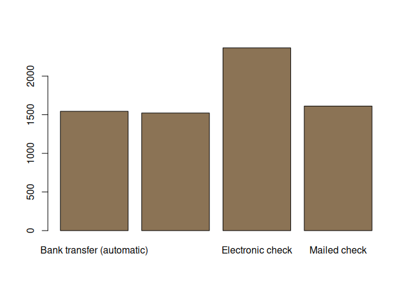
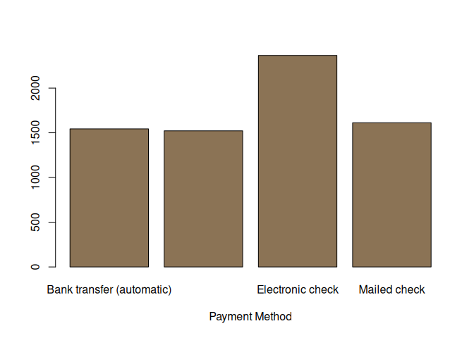
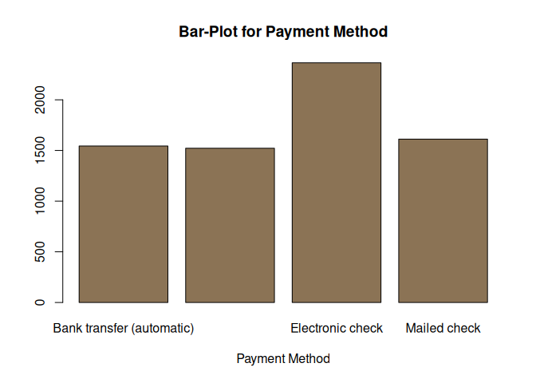
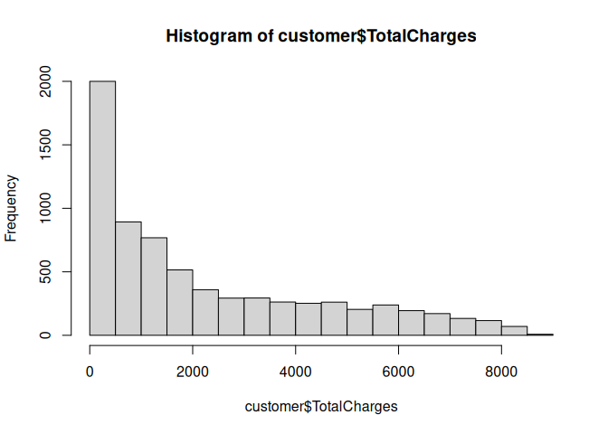
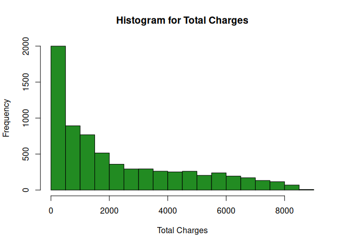
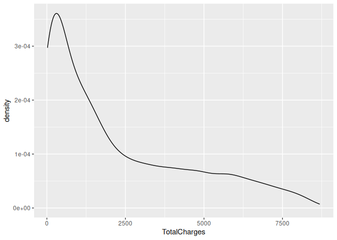
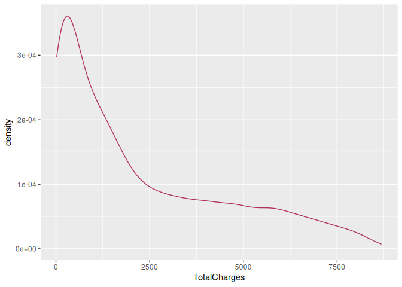
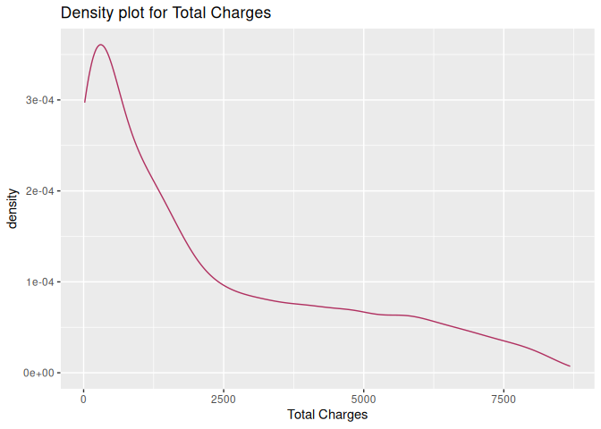

Data visualization
================
Monalisa Roy

### Read the data

``` r
customer=read.csv("customer-churn",stringsAsFactors = T)
```

### Loading the relevant plotting library

-   We are going to use ggplot here. If it is not installed, then
    un-comment the line install(ggplot2)

``` r
#install(ggplot2)
library(ggplot2)
```

### Creating plots

-   We create a bar-plot for a column, say ‘PaymentMethod’.

``` r
plot(customer$PaymentMethod)
```

<!-- -->
### Coloring

-   Assigning the color ‘burlywood4’.

``` r
plot(customer$PaymentMethod,col="burlywood4")
```

<!-- -->
### Naming the axes

-   We assign the x-axis label to the ‘Payment Method’.

``` r
plot(customer$PaymentMethod,col="burlywood4",xlab="Payment Method")
```

<!-- -->

### Assigning a title

-   We assign the title to be “Bar-Plot for Payment Method”.

``` r
plot(customer$PaymentMethod,col="burlywood4",xlab="Payment Method",main="Bar-Plot for Payment Method")
```

<!-- -->
### Creating histograms

-   We create a histogram for the ’TotalCharges’column.

``` r
hist(customer$TotalCharges)
```

<!-- -->

### Histogram coloring

-   We assign the color ‘forestgreen’.

``` r
hist(customer$TotalCharges,col="forestgreen")
```

<!-- -->
### Histogram axes label

-   We assign the x-axis label to the ‘Total Charges’.

``` r
hist(customer$TotalCharges,col="forestgreen",xlab = "Total Charges")
```

<!-- -->
### Assigning a title for histogram

-   We assign the title to be “Histogram for Total Charges”.

``` r
hist(customer$TotalCharges,col="forestgreen",xlab = "Total Charges",main = "Histogram for Total Charges")
```

<!-- -->

### Creating density plots

-   We create a density plot for the ’TotalCharges’column.

``` r
ggplot(data = customer,aes(x=TotalCharges))+geom_density()
```

    ## Warning: Removed 11 rows containing non-finite values (`stat_density()`).

<!-- -->
### Coloring density plot

-   We assign the color ‘maroon’

``` r
ggplot(data = customer,aes(x=TotalCharges))+geom_density(col="maroon")
```

    ## Warning: Removed 11 rows containing non-finite values (`stat_density()`).

<!-- -->

### Density plot axes labeling

-   We assign the x-axis label to the ‘Total Charges’.

``` r
ggplot(data = customer,aes(x=TotalCharges))+geom_density(col="maroon")+xlab("Total Charges")
```

    ## Warning: Removed 11 rows containing non-finite values (`stat_density()`).

<!-- -->
### Assigning a title to a density plot

-   We assign the title to be “Density plot for Total Charges”.

``` r
ggplot(data = customer,aes(x=TotalCharges))+geom_density(col="maroon")+xlab("Total Charges")+ggtitle("Density plot for Total Charges")
```

    ## Warning: Removed 11 rows containing non-finite values (`stat_density()`).

<!-- -->
