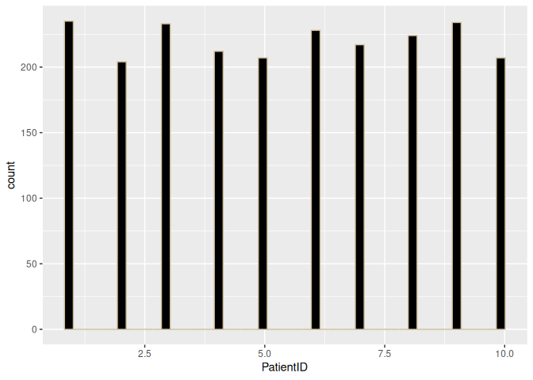
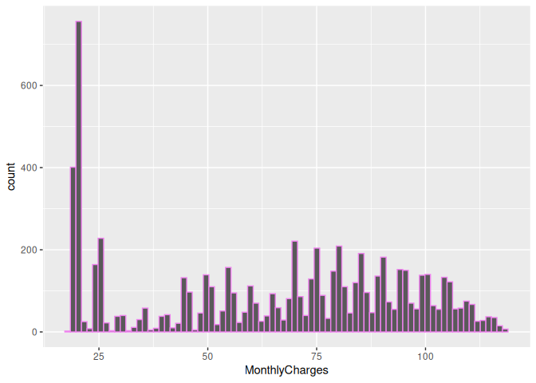

Bins Attribute in R
================
Monalisa Roy

## Read the data

``` r
customer=read.csv("customer-churn",stringsAsFactors = T)
pharma=read.csv("Pharmacovigilance_audit_Data.csv",stringsAsFactors = T)
```

## Install packages

``` r
library(ggplot2)
```

## Create a histogram for ‘Age’ column using pharmacovigilance dataset.

### Set number of bins to 100

``` r
ggplot(data = pharma,aes(x=Age))+geom_histogram(bins = 100)
```

<!-- -->

### Assign a color ‘azure’ to the histogram

``` r
ggplot(data = pharma,aes(x=Age))+geom_histogram(bins = 100,col="azure")
```

<!-- -->

### Assign a colour ‘white’ to the fill attribute in geom_histogram function.

``` r
ggplot(data = pharma,aes(x=Age))+geom_histogram(bins = 100,col="azure",fill="white")
```

<!-- -->

## Create a histogram for ‘PatientID’ column using pharmacovigilance dataset.

### Assign a color ‘wheat3’ to the histogram

``` r
ggplot(data = pharma,aes(x=PatientID))+geom_histogram(col="wheat3")
```

    ## `stat_bin()` using `bins = 30`. Pick better value with `binwidth`.

<!-- -->

### Set number of bins to 50

``` r
ggplot(data = pharma,aes(x=PatientID))+geom_histogram(col="wheat3",bins = 50)
```

<!-- -->

### Assign a colour ‘black’ to the fill attribute in geom_histogram function.

``` r
ggplot(data = pharma,aes(x=PatientID))+geom_histogram(col="wheat3",bins = 50,fill="black")
```

<!-- -->

## Create a histogram using customer churn dataset.

### Assign MonthlyCharges column to the x-axis

``` r
ggplot(data=customer,aes(x=MonthlyCharges))+geom_histogram()
```

    ## `stat_bin()` using `bins = 30`. Pick better value with `binwidth`.

<!-- -->

### Set the number of bins to 80

``` r
ggplot(data=customer,aes(x=MonthlyCharges))+geom_histogram(bins = 80)
```

<!-- -->

### Assign a color ‘violet’ to the bars.

``` r
ggplot(data=customer,aes(x=MonthlyCharges))+geom_histogram(bins = 80,col="violet")
```

<!-- -->

### Assign a colour ‘white’ to the fill attribute in geom_histogram function.

``` r
ggplot(data=customer,aes(x=MonthlyCharges))+geom_histogram(bins = 80,col="violet",fill="white")
```

<!-- -->

## Create a histogram using customer churn dataset.

### Assign ‘tenure’ column to the x-axis.

``` r
ggplot(data = customer,aes(x=tenure))+geom_histogram()
```

    ## `stat_bin()` using `bins = 30`. Pick better value with `binwidth`.

<!-- -->

### Set the number of bins to 50

``` r
ggplot(data = customer,aes(x=tenure))+geom_histogram(bins=50)
```

<!-- -->

### Assign a color ‘white’ to the bars.

``` r
ggplot(data = customer,aes(x=tenure))+geom_histogram(bins=50,col="white")
```

<!-- -->

### Assign a colour ‘black’ to the fill attribute in geom_histogram function.

``` r
ggplot(data = customer,aes(x=tenure))+geom_histogram(bins=50,col="white",fill="black")
```

<!-- -->
