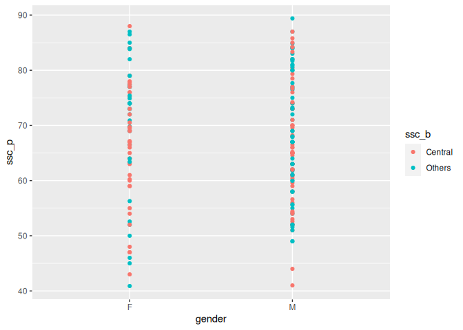
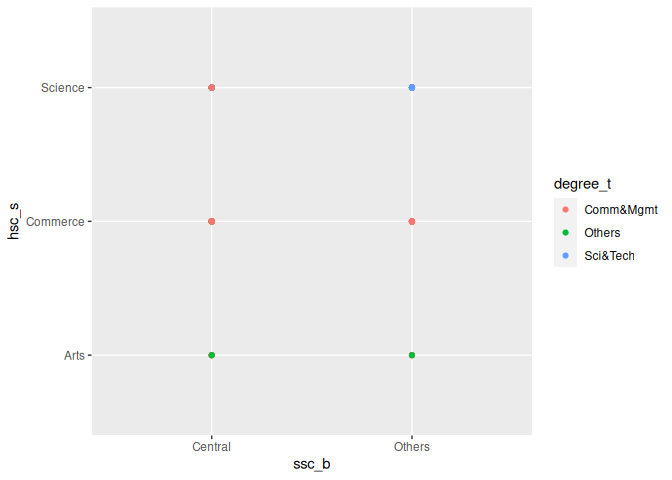
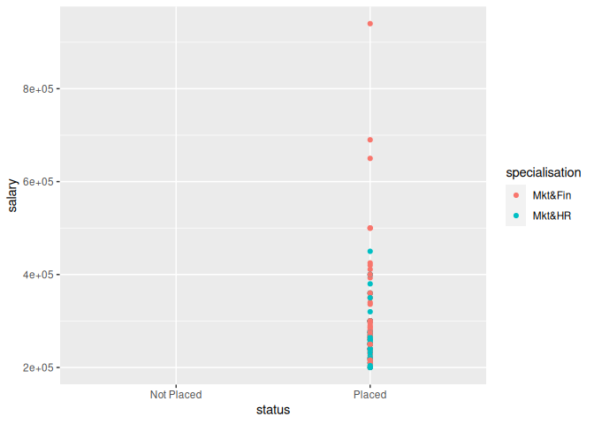
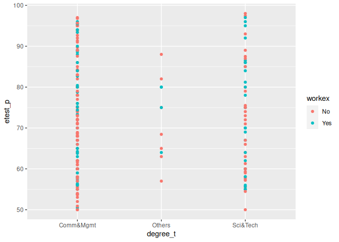
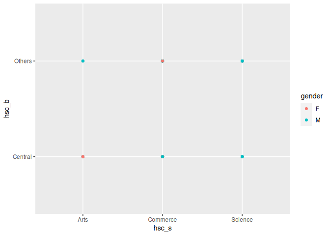
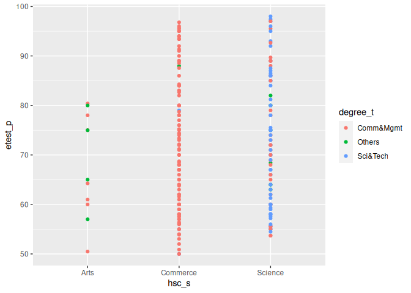

Col Attribute in R
================
Monalisa Roy

## Read the data

``` r
placement=read.csv("Placement_Data_Full_Class.csv",stringsAsFactors = T)
View(placement)
```

-   Install packages

``` r
library(ggplot2)
```

## Create the following geom_point() where:

-   ‘Gender’ is assigned to x-axis.’ssc_p’to y-axis, and map ‘ssc_b’
    with col aesthetic

``` r
ggplot(data = placement,aes(x=gender,y=ssc_p,col=ssc_b))+geom_point()
```

<!-- -->

-   ‘ssc_b’ is assigned to x-axis.’hsc_s’to y-axis, and map ‘degree_t’
    with col aesthetic

``` r
ggplot(data = placement,aes(x=ssc_b,y=hsc_s,col=degree_t))+geom_point()
```

<!-- -->

-   ‘Status’ is assigned to x-axis.’salary’to y-axis, and map
    ‘specialisation’ with col aesthetic

``` r
ggplot(data = placement,aes(x=status,y=salary,col=specialisation))+geom_point()
```

    ## Warning: Removed 67 rows containing missing values (`geom_point()`).

<!-- -->

-   ‘Degree_t’ is assigned to x-axis.’etest_p’to y-axis, and map
    ‘workex’ with col aesthetic

``` r
ggplot(data = placement,aes(x=degree_t,y=etest_p,col=workex))+geom_point()
```

<!-- -->

-   ‘hsc_s’ is assigned to x-axis.’hsc_b’to y-axis, and map ‘gender’
    with col aesthetic

``` r
ggplot(data = placement,aes(x=hsc_s,y=hsc_b,col=gender))+geom_point()
```

<!-- -->

-   ‘hsc_s’ is assigned to x-axis.’etest_p’to y-axis, and map ‘degree_t’
    with col aesthetic

``` r
ggplot(data = placement,aes(x=hsc_s,y=etest_p,col=degree_t))+geom_point()
```

<!-- -->
