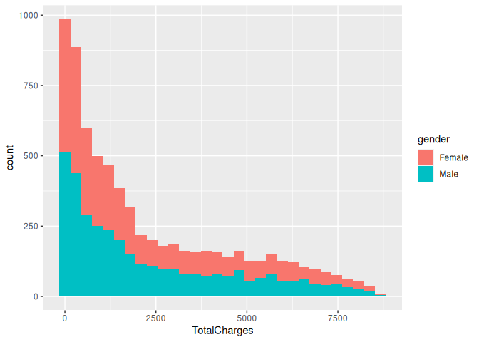
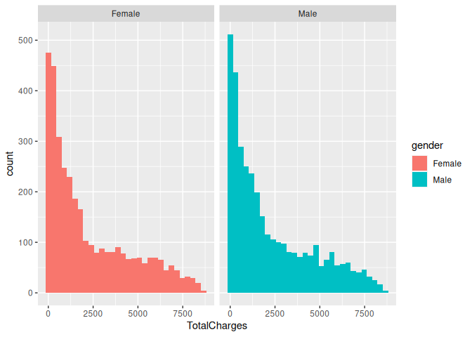
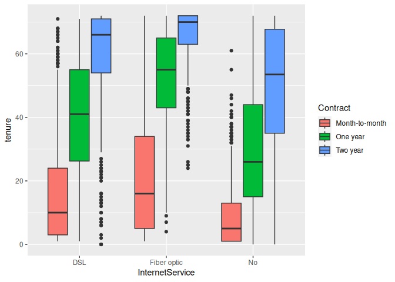
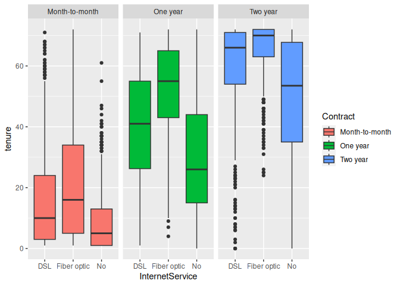
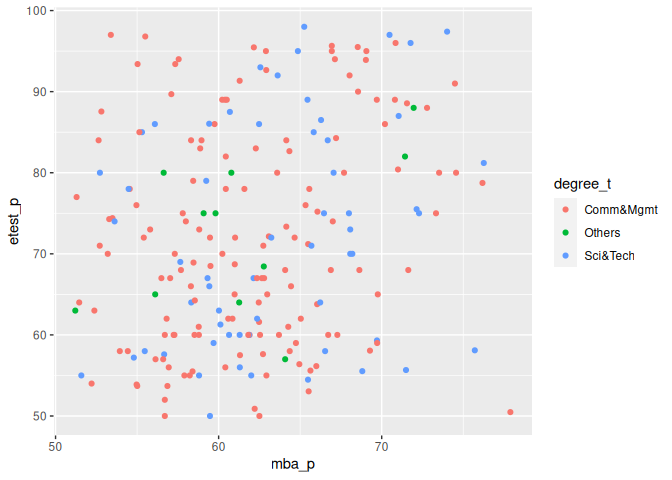
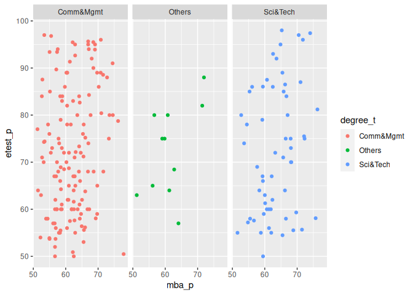

Facet-grid-Attribute_in_R
================
Monalisa Roy

### Read the data

``` r
customer=read.csv("customer-churn",stringsAsFactors = T)

placement=read.csv("Placement_Data_Full_Class.csv",stringsAsFactors = T)
```

### Install packages

``` r
library(ggplot2)
```

### Build a histogram for the ’TotalCharges’column.Map ’gender’onto fill aesthetic.

### Facet the plot w.r.t ’gender’column.

``` r
ggplot(data = customer,aes(x=TotalCharges,fill=gender))+geom_histogram()->graph1
graph1
```

    ## `stat_bin()` using `bins = 30`. Pick better value with `binwidth`.

    ## Warning: Removed 11 rows containing non-finite values (`stat_bin()`).

<!-- -->

``` r
graph1+facet_grid(~gender)
```

    ## `stat_bin()` using `bins = 30`. Pick better value with `binwidth`.

    ## Warning: Removed 11 rows containing non-finite values (`stat_bin()`).

<!-- -->

### Build a box-plot between ‘tenure’ & ‘InternetSerice’.Map ‘tenure’ on the y-axis and ’InternetService’on the x-axis.Map ’Contract’to the fill aesthetic

### facet the plot w.r.t ‘Contract’ column

``` r
ggplot(data = customer,aes(x=InternetService,y=tenure,fill=Contract))+geom_boxplot()->graph2
graph2
```

<!-- -->

``` r
graph2+facet_grid(~Contract)
```

<!-- -->

### Build a scatter plot between ‘etest_p’ and ‘mba_p’.Map ‘etest_p’on the y-axis and ’mba_p’ on the x-axis.Map ’degree_t’onto col aesthetic

### facet the plot w.r.t ’degree_t’column.

``` r
ggplot(data = placement,aes(x=mba_p,y=etest_p,col=degree_t))+geom_point()->graph3
graph3
```

<!-- -->

``` r
graph3+facet_grid(~degree_t)
```

<!-- -->
