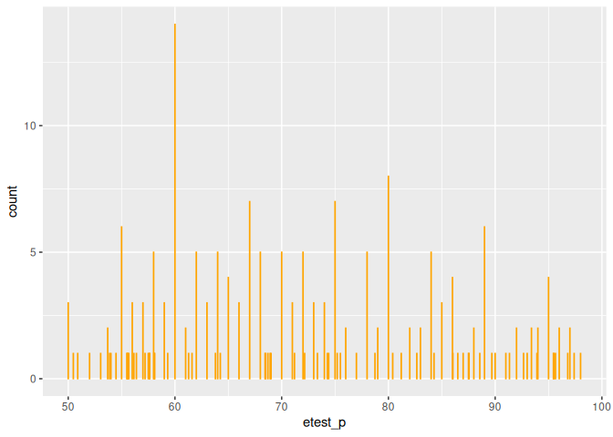
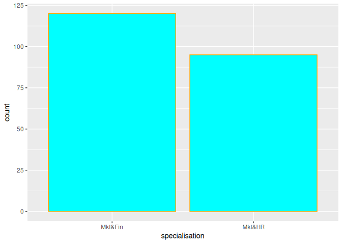
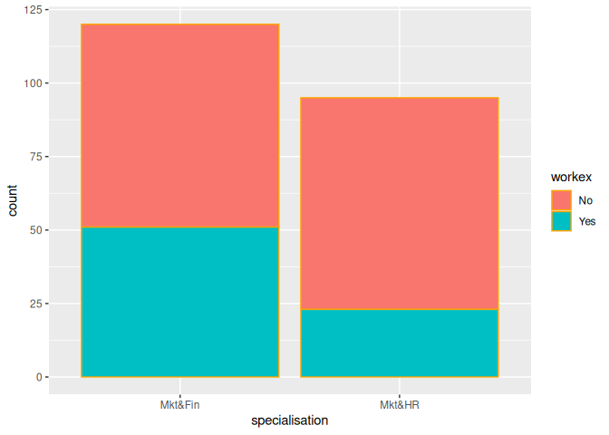
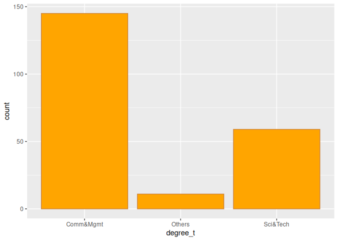
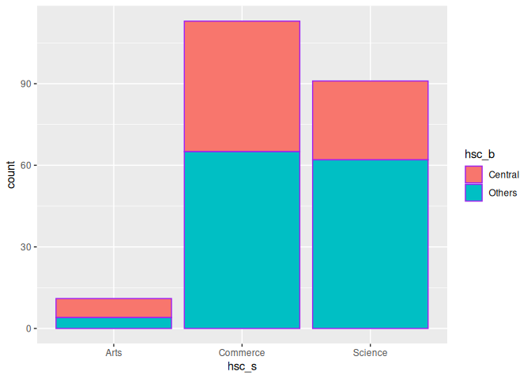
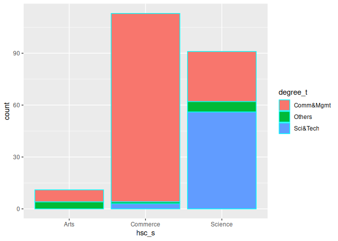
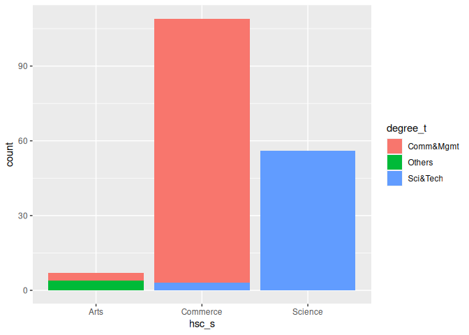

Fill-Attribute_in_R
================
Monalisa Roy

### Read the data

``` r
placement=read.csv("Placement_Data_Full_Class.csv",stringsAsFactors = T)
```

### Install packages

``` r
library(ggplot2)
```

### Build a bar-plot

### Assign ‘etest_p’ column to x-axis

``` r
ggplot(data = placement,aes(x=etest_p))+geom_bar(col="orange")
```

<!-- -->

### Assign ’specialisation’column to x-axis

``` r
ggplot(data = placement,aes(x=specialisation))+geom_bar(fill="cyan",col="orange")
```

<!-- -->

### Assign ‘workex’ to the fill attribute

``` r
ggplot(data = placement,aes(x=specialisation,fill=workex))+geom_bar(col="orange")
```

<!-- -->

### Build a bar-plot for the ‘degree_t’ column

### Assign the fill color to be ‘orange’

``` r
ggplot(data = placement,aes(x=degree_t))+geom_bar(fill="orange")
```

<!-- -->

### Assign the boundary color to be ‘peru’

``` r
ggplot(data = placement,aes(x=degree_t))+geom_bar(fill="orange",col="peru")
```

<!-- -->

### Build a bar-plot for the ’hsc_s’ column assigned to x-axis and then:

### Assign ‘hsc_b’ to the fill aesthetic

``` r
ggplot(data = placement,aes(x=hsc_s,fill=hsc_b))+geom_bar(col="purple")
```

<!-- -->

### Assign ‘degree_t’ to the fill aesthetic

``` r
ggplot(data = placement,aes(x=hsc_s,fill=degree_t))+geom_bar(col="cyan")
```

<!-- -->

### Change the position of bars to ‘identity’

``` r
ggplot(data = placement,aes(x=hsc_s,fill=degree_t))+geom_bar(position ="identity")
```

<!-- -->
