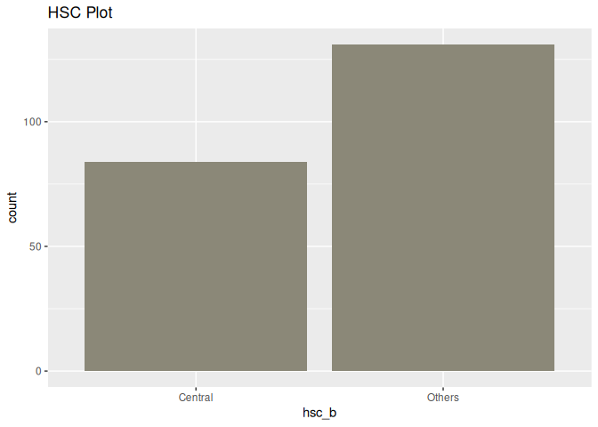

Labs in R
================
Monalisa Roy

### Read the data, load libraries

``` r
placement=read.csv("Placement_Data_Full_Class.csv",stringsAsFactors = T)

library(ggplot2)
```

### Create a bar-plot as per the following conditions.

**Assign ’degree_t’to the x-axis**

``` r
ggplot(data = placement,aes(x=degree_t))+geom_bar()+xlab("degree_t")
```

<!-- -->

**Give title of the plot as ‘Degree Plot’**

``` r
ggplot(data = placement,aes(x=degree_t))+geom_bar()+xlab("degree_t")+ggtitle("Degree Plot")
```

<!-- -->

**Assign a color ‘yellowgreen’**

``` r
ggplot(data = placement,aes(x=degree_t))+geom_bar(fill="yellowgreen")+xlab("degree_t")+ggtitle("Degree Plot")
```

<!-- -->

### Create a bar-plot as per the following conditions.

**Assign ’ssc_b’to the x-axis.**

``` r
ggplot(data = placement,aes(x=ssc_b))+geom_bar()+xlab("ssc_b")
```

<!-- -->

**Give title of the plot as ‘SSC Plot’.**

``` r
ggplot(data = placement,aes(x=ssc_b))+geom_bar()+xlab("ssc_b")+ggtitle("SSC Plot")
```

<!-- -->

**Assign a color ‘beige’**

``` r
ggplot(data = placement,aes(x=ssc_b))+geom_bar(fill="beige")+xlab("ssc_b")+ggtitle("SSC Plot")
```

<!-- -->

### Create a bar-plot as per the following conditions.

**Assign ’hsc_b’to the x-axis.**

``` r
ggplot(data = placement,aes(x=hsc_b))+geom_bar()+xlab("hsc_b")
```

<!-- -->

**Give title of the plot as ‘HSC Plot’.**

``` r
ggplot(data = placement,aes(x=hsc_b))+geom_bar()+xlab("hsc_b")+ggtitle("HSC Plot")
```

<!-- -->

**Assign a color ‘cornsilk4’.**

``` r
ggplot(data = placement,aes(x=hsc_b))+geom_bar(fill="cornsilk4")+xlab("hsc_b")+ggtitle("HSC Plot")
```

<!-- -->

### Create a bar-plot as per the following conditions

**Assign ’specialisation’to the x-axis.**

``` r
ggplot(data = placement,aes(x=specialisation))+geom_bar()+xlab("specialisation")
```

<!-- -->

**Give title of the plot as ‘Specialisation Plot’.**

``` r
ggplot(data = placement,aes(x=specialisation))+geom_bar()+xlab("specialisation")+ggtitle("Specialisation Plot")
```

<!-- -->

**Assign a color ‘pink’.**

``` r
ggplot(data = placement,aes(x=specialisation))+geom_bar(fill="pink")+xlab("specialisation")+ggtitle("Specialisation Plot")
```

<!-- -->
