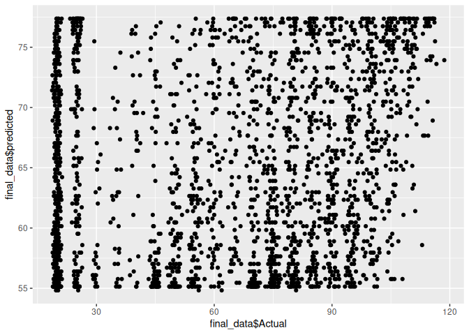
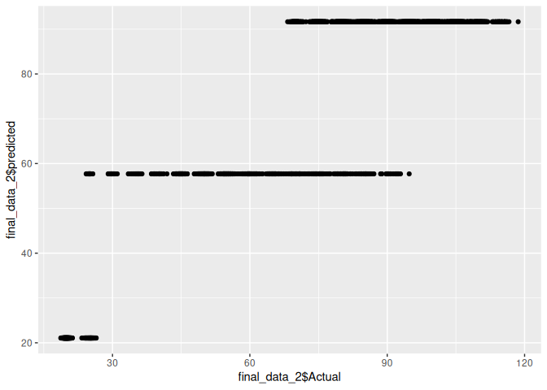
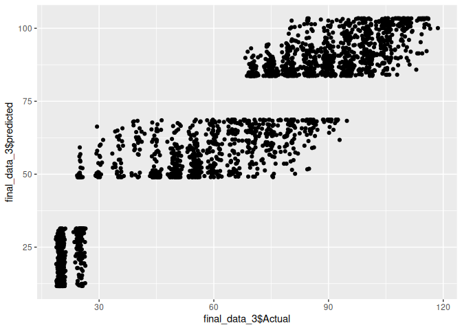

Linear Regression
================
Monalisa Roy

## Read the data,load libraries

``` r
customer=read.csv("customer-churn")
View(customer)

library(caTools)
library(dplyr)
```

    ## 
    ## Attaching package: 'dplyr'

    ## The following objects are masked from 'package:stats':
    ## 
    ##     filter, lag

    ## The following objects are masked from 'package:base':
    ## 
    ##     intersect, setdiff, setequal, union

``` r
library(ggplot2)
library(corrplot)
```

    ## corrplot 0.92 loaded

``` r
library(ggcorrplot)
library(rpart)
library(rpart.plot)
library(tree)
library(readr)
```

## Splitting the dataframe

``` r
sample.split(customer$MonthlyCharges,SplitRatio = 0.65)->split_tag
```

## Train and Test data

``` r
subset(customer,split_tag==T)->train
subset(customer,split_tag==F)->test
```

## Rows in Train and Test data

``` r
nrow(train)
```

    ## [1] 4697

``` r
nrow(test)
```

    ## [1] 2346

## Linear Regression Model

``` r
lm(MonthlyCharges~tenure,data = train)->model1
```

## predicting the value

``` r
predict(model1,newdata = test)->predicted_values
```

## Final data

``` r
cbind(Actual=test$MonthlyCharges,predicted=predicted_values)->final_data
View(final_data)
```

## Class of final data

``` r
class(final_data)
```

    ## [1] "matrix" "array"

``` r
as.data.frame(final_data)->final_data
class(final_data)
```

    ## [1] "data.frame"

## Plot the prediction and actual values

``` r
ggplot(data=final_data,aes(x=final_data$Actual,y=final_data$predicted))+geom_point()
```

<!-- -->

## Prediction of error

``` r
final_data$Actual-final_data$predicted->error
as.data.frame(error)->error
View(error)
cbind(final_data,error)->final_data
View(final_data)
```

## Root Mean Square Error(RMSE)

``` r
sqrt(mean((final_data$error)^2))->rmse_1
rmse_1
```

    ## [1] 29.28688

## Linear Regression Model with different independent and dependent variable

``` r
lm(MonthlyCharges~InternetService,data = train)->model2
```

## Predict the value

``` r
predict(model2,newdata = test)->predicted_values_2
```

## Final data

``` r
cbind(Actual=test$MonthlyCharges,predicted=predicted_values_2)->final_data_2
View(final_data_2)
```

## Class of final data

``` r
class(final_data_2)
```

    ## [1] "matrix" "array"

``` r
as.data.frame(final_data_2)->final_data_2
class(final_data_2)
```

    ## [1] "data.frame"

``` r
ggplot(data=final_data_2,aes(x=final_data_2$Actual,y=final_data_2$predicted))+geom_point()
```

<!-- -->

## Prediction of error

``` r
final_data_2$Actual-final_data_2$predicted->error1
cbind(final_data_2,error1)->final_data_2
View(final_data_2)
```

## Root Mean Square Error(RMSE)

``` r
sqrt(mean((final_data_2$error1)^2))->rmse_2
rmse_2
```

    ## [1] 12.67039

**Therefore here the error decreases**

## Linear Regression Model with joint independent and dependent variable

``` r
lm(MonthlyCharges~InternetService+tenure+Contract,data = train)->model3
```

## Predict the value

``` r
predict(model3,newdata = test)->predicted_values_3
```

## Final data

``` r
cbind(Actual=test$MonthlyCharges,predicted=predicted_values_3)->final_data_3
View(final_data_3)
```

## Class of final data

``` r
class(final_data_3)
```

    ## [1] "matrix" "array"

``` r
as.data.frame(final_data_3)->final_data_3
class(final_data_3)
```

    ## [1] "data.frame"

``` r
ggplot(data=final_data_3,aes(x=final_data_3$Actual,y=final_data_3$predicted))+geom_point()
```

<!-- -->

## Prediction of error

``` r
final_data_3$Actual-final_data_3$predicted->error1
cbind(final_data_3,error1)->final_data_3
View(final_data_3)
```

## Root Mean Square Error(RMSE)

``` r
sqrt(mean((final_data_3$error1)^2))->rmse_3
rmse_3
```

    ## [1] 10.74002

**A joint analysis helps decreasing the error by 2**
