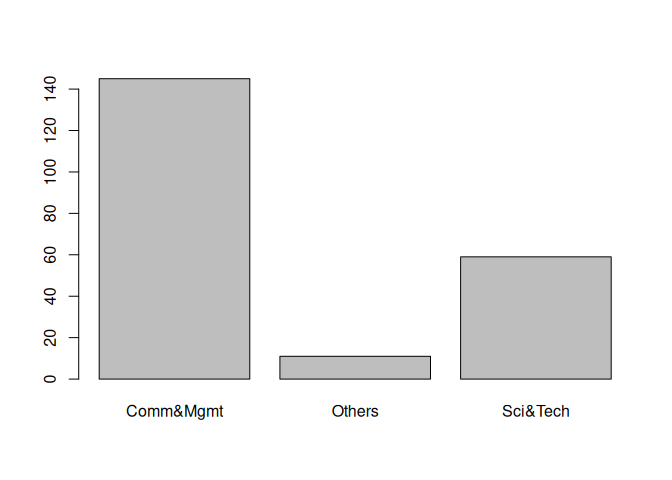
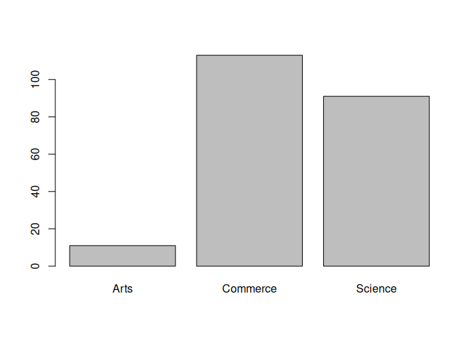
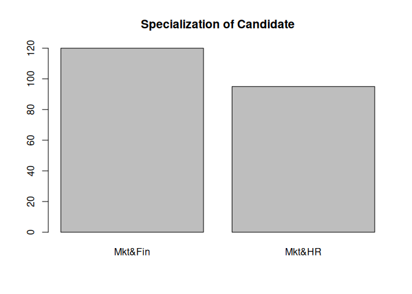
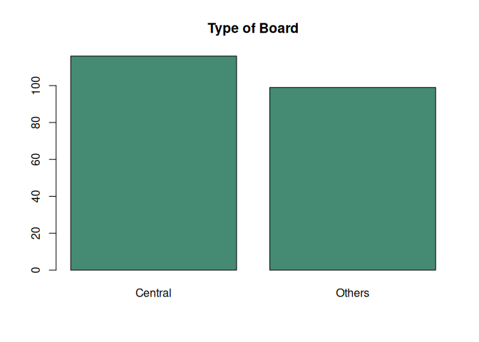

Plots in R
================
Monalisa Roy

## Read the data

``` r
placement=read.csv("Placement_Data_Full_Class.csv",stringsAsFactors = T)
View(placement)
```

### Create a plot to understand the distribution of degree_t column

``` r
plot(placement$degree_t)
```

<!-- -->

### Create a plot to understand the distribution of hsc_s column

``` r
plot(placement$hsc_s)
```

<!-- -->

### Create a plot for specialization column and give a heading as ‘Specialization of Candidate’

``` r
plot(placement$specialisation,main="Specialization of Candidate")
```

<!-- -->

### Create a plot using ssc_b,give it a color of ‘aquamarine4’,and give a heading as ‘Type of Board’

``` r
plot(placement$ssc_b,col="aquamarine4",main="Type of Board")
```

<!-- -->
