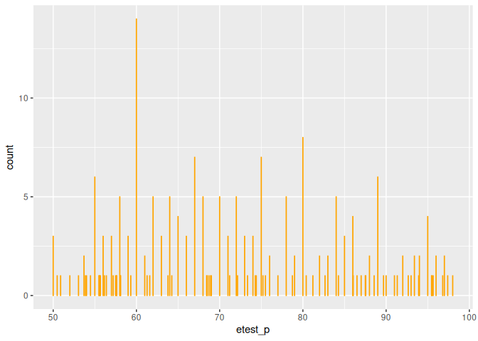
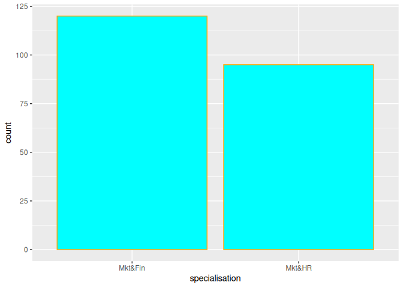
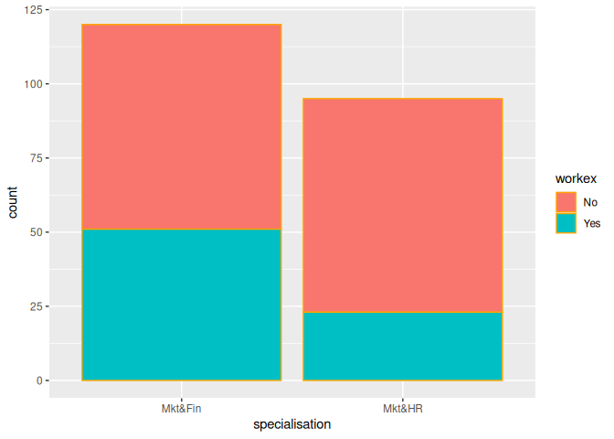
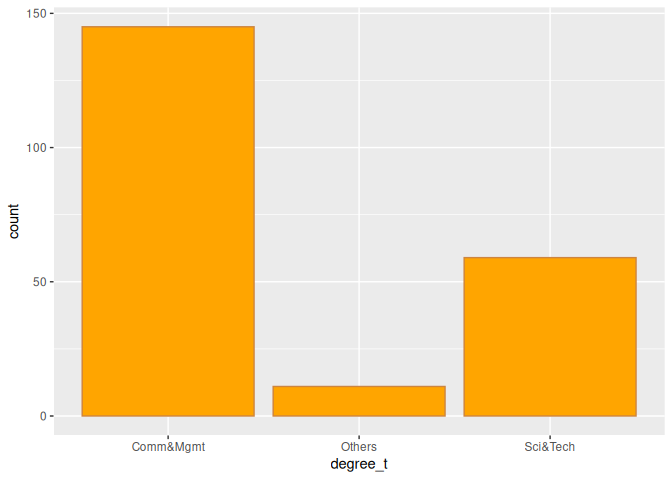
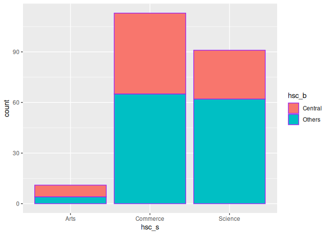
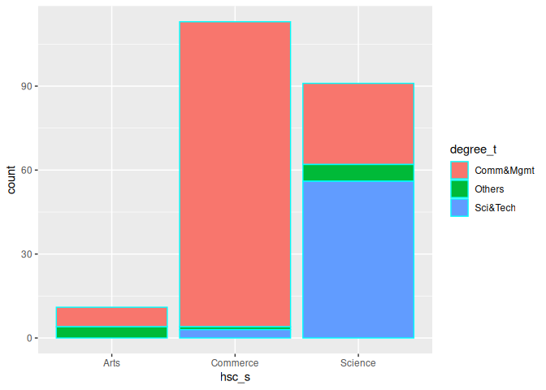
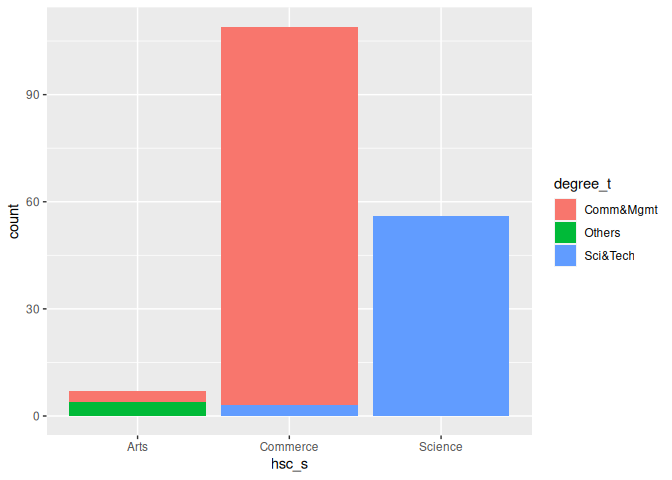

R Notebook
================
Monalisa Roy

### Read the data

``` r
placement=read.csv("Placement_Data_Full_Class.csv",stringsAsFactors = T)
```

### Loading the relevant plotting library

-   We are going to use ggplot here. If it is not installed, then
    un-comment the line install(ggplot2)

``` r
#install(ggplot2)
library(ggplot2)
```

\*\* Building a bar-plot

-   Assigning a column to x-axis

``` r
ggplot(data = placement,aes(x=etest_p))+geom_bar(col="orange")
```

<!-- -->

-   Assigning ’specialisation’column to x-axis

``` r
ggplot(data = placement,aes(x=specialisation))+geom_bar(fill="cyan",col="orange")
```

<!-- -->

-   Assigning ‘workex’ to the fill attribute

``` r
ggplot(data = placement,aes(x=specialisation,fill=workex))+geom_bar(col="orange")
```

<!-- -->

-   Building a bar-plot for the ‘degree_t’ column

-   Also we assign the fill color to be ‘orange’

-   and assign the boundary color to be ‘peru’

``` r
ggplot(data = placement,aes(x=degree_t))+geom_bar(fill="orange",col="peru")
```

<!-- -->

-   Building a bar-plot for the ’hsc_s’ column assigned to x-axis and
    then:

-   Here we assign ‘hsc_b’ to the fill aesthetic

``` r
ggplot(data = placement,aes(x=hsc_s,fill=hsc_b))+geom_bar(col="purple")
```

<!-- -->

-   Now we assign ‘degree_t’ to the fill aesthetic

``` r
ggplot(data = placement,aes(x=hsc_s,fill=degree_t))+geom_bar(col="cyan")
```

<!-- -->

-   Changing the position of bars to ‘identity’

``` r
ggplot(data = placement,aes(x=hsc_s,fill=degree_t))+geom_bar(position ="identity")
```

<!-- -->
