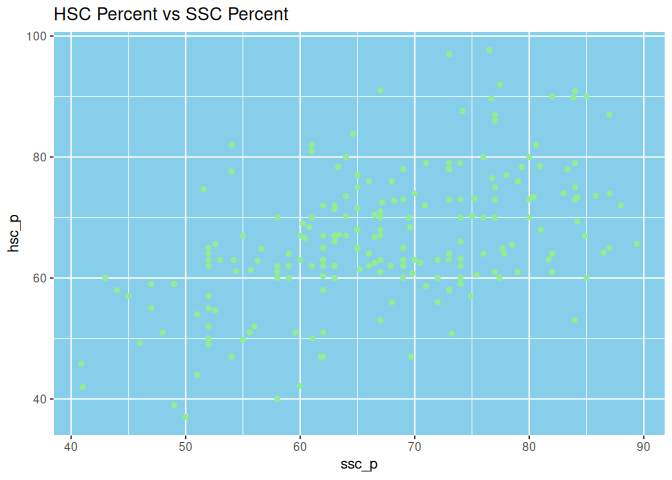
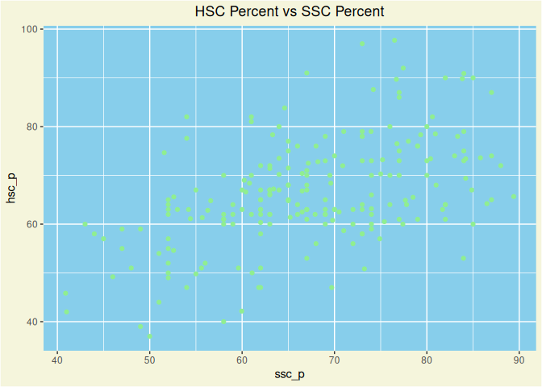

Theme
================
Monalisa Roy

### Read the data, load libraries

``` r
placement=read.csv("Placement_Data_Full_Class.csv",stringsAsFactors = T)

library(ggplot2)
```

### Building a bar-plot for the ‘specialisation’ column. Give it a fill color of ’skyblue

``` r
ggplot(data = placement,aes(x=specialisation))+geom_bar(fill="skyblue")
```

<!-- -->

**Giving the panel a background color of ‘cornsilk4’**

``` r
ggplot(data = placement,aes(x=specialisation))+geom_bar(fill="skyblue")+theme(panel.background = element_rect(fill="cornsilk4"))
```

<!-- -->

**Giving the plot a background color of ‘lightgreen’**

``` r
ggplot(data = placement,aes(x=specialisation))+geom_bar(fill="skyblue")+theme(panel.background = element_rect(fill="cornsilk4"))+theme(plot.background = element_rect(fill="lightgreen"))
```

<!-- -->

### Building a scatter-plot between ‘hsc_p’ & ‘ssc_p’. Mapping ‘hsc_p’ on the y-axis & ‘ssc_p’ on the x-axis. Assigning a color of ‘lightgreen’ to the points.

``` r
ggplot(data = placement,aes(x=ssc_p,y=hsc_p))+geom_point(col="lightgreen")
```

<!-- -->

**Add a title to the plot ‘HSC Percent vs SSC Percent’**

``` r
ggplot(data = placement,aes(x=ssc_p,y=hsc_p))+geom_point(col="lightgreen")+ggtitle("HSC Percent vs SSC Percent")
```

<!-- -->

**Giving the pannel a background color of ‘skyblue’**

``` r
ggplot(data = placement,aes(x=ssc_p,y=hsc_p))+geom_point(col="lightgreen")+ggtitle("HSC Percent vs SSC Percent")+theme(panel.background = element_rect(fill="skyblue"))
```

<!-- -->

**Giving the plot a background color of ‘beige’**

``` r
ggplot(data = placement,aes(x=ssc_p,y=hsc_p))+geom_point(col="lightgreen")+ggtitle("HSC Percent vs SSC Percent")+theme(panel.background = element_rect(fill="skyblue"))+theme(plot.background = element_rect(fill="beige"))
```

<!-- -->

**Center aligning the title**

``` r
ggplot(data = placement,aes(x=ssc_p,y=hsc_p))+geom_point(col="lightgreen")+ggtitle("HSC Percent vs SSC Percent")+theme(plot.title = element_text(hjust = 0.5))+theme(panel.background = element_rect(fill="skyblue"))+theme(plot.background = element_rect(fill="beige"))
```

<!-- -->
