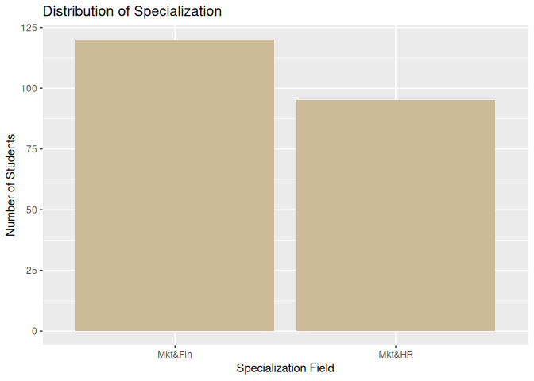

Xlab-Ylab attribute
================
Monalisa Roy

### Read the data, load libraries

``` r
placement=read.csv("Placement_Data_Full_Class.csv",stringsAsFactors = T)

library(ggplot2)
```

### Creating a plot using ggplot()function for hsc_s column, assigning a color ‘orange’, and labelling x-axis as ‘Higher Secondary Subjects’.

``` r
ggplot(data = placement,aes(x=hsc_s))+geom_bar(fill="orange")+xlab("Higher Secondary Subjects")
```

<!-- -->

### Creating a plot using ggplot()function for degree_t column:

``` r
ggplot(data = placement,aes(x=degree_t))+geom_bar()
```

<!-- -->

**Assigning color ‘palegreen4’**

``` r
ggplot(data = placement,aes(x=degree_t))+geom_bar(fill="palegreen4")
```

<!-- -->

**Labeling x-axis as ‘Percentage in Graduation’**

``` r
ggplot(data = placement,aes(x=degree_t))+geom_bar(fill="palegreen4")+xlab("Percentage in Graduation")
```

<!-- -->

**Labeling y-axis as ‘Number of Students’**

``` r
ggplot(data = placement,aes(x=degree_t))+geom_bar(fill="palegreen4")+xlab("Percentage in Graduation")+ylab("Number of Students")
```

<!-- -->

### Creating a plot using ggplot()function for specialisation column:Assign a color ‘wheat3’

``` r
ggplot(data = placement,aes(x=specialisation))+geom_bar(fill="wheat3")
```

<!-- -->

**Labeling x-axis as ‘Specialization Field’**

``` r
ggplot(data = placement,aes(x=specialisation))+geom_bar(fill="wheat3")+xlab("Specialization Field")
```

<!-- -->

**Labeling y-axis as ‘Number of Students’**

``` r
ggplot(data = placement,aes(x=specialisation))+geom_bar(fill="wheat3")+xlab("Specialization Field")+ylab("Number of Students")
```

<!-- -->

**Giving a heading using ‘main’ attribute as ‘Distribution of
Specialization’**

``` r
ggplot(data = placement,aes(x=specialisation))+geom_bar(fill="wheat3")+xlab("Specialization Field")+ylab("Number of Students")+labs(title ="Distribution of Specialization")
```

<!-- -->
