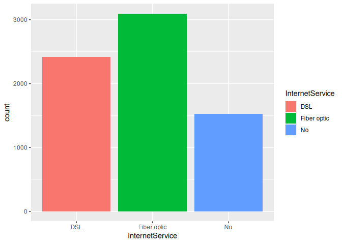
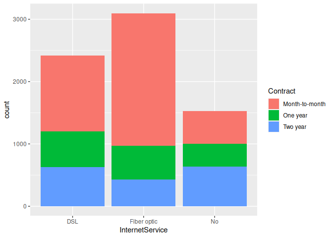

geom bar function case study
================
Monalisa Roy

### Read the data

``` r
customer=read.csv("customer-churn",stringsAsFactors = T)
```

### Loading the relevant plotting library

-   We are going to use ggplot here. If it is not installed, then
    un-comment the line install(ggplot2)

``` r
#install(ggplot2)
library(ggplot2)
```

### Bar plot

-   We build a bar-plot for the ’PhoneService’column.

``` r
ggplot(data = customer,aes(x=PhoneService))+geom_bar()
```

<!-- -->

### Coloring a bar plot

-   We assign the fill color to be ‘pink’.

``` r
ggplot(data = customer,aes(x=PhoneService))+geom_bar(fill="pink")
```

<!-- -->

### Coloring boundaries

-   We assign the boundary color to be “peru”.

``` r
ggplot(data = customer,aes(x=PhoneService))+geom_bar(fill="pink",col="peru")
```

<!-- -->

-   Creating a bar-plot for the ‘InternetService’ column.

``` r
ggplot(data = customer,aes(x=InternetService))+geom_bar()
```

<!-- -->
### Filling aesthetic

-   Assigning ‘InternetService’ to the fill aesthetic.

``` r
ggplot(data = customer,aes(x=InternetService,fill=InternetService))+geom_bar()
```

<!-- -->

-   Assigning ‘Contract’ to the fill aesthetic.

``` r
ggplot(data = customer,aes(x=InternetService,fill=Contract))+geom_bar()
```

<!-- -->

### Changing position

-   We change the position of bars to ‘identity’

``` r
ggplot(data = customer,aes(x=InternetService,fill=Contract))+geom_bar(position = "identity")
```

<!-- -->

-   Building a bar-plot for ’TechSupport’column

``` r
ggplot(data = customer,aes(x=TechSupport))+geom_bar()
```

<!-- -->

-   Assigning ‘Churn’ to the fill aesthetic.

``` r
ggplot(data = customer,aes(x=TechSupport,fill=Churn))+geom_bar()
```

<!-- -->
