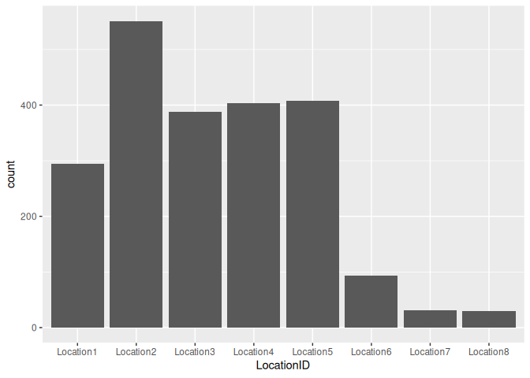
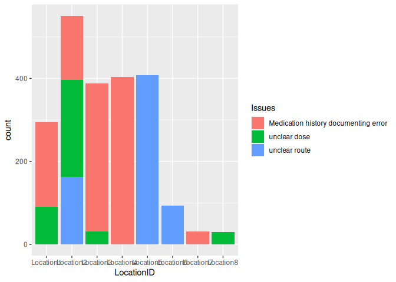
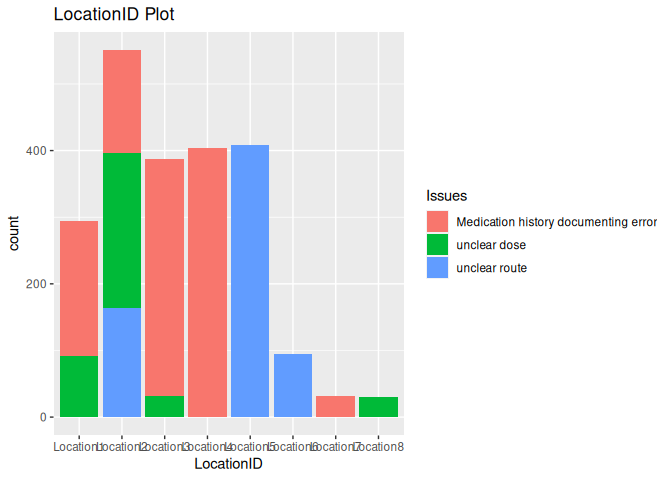
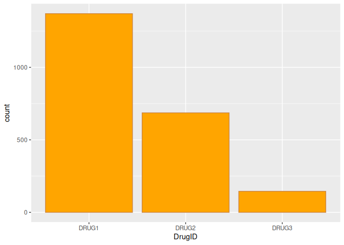
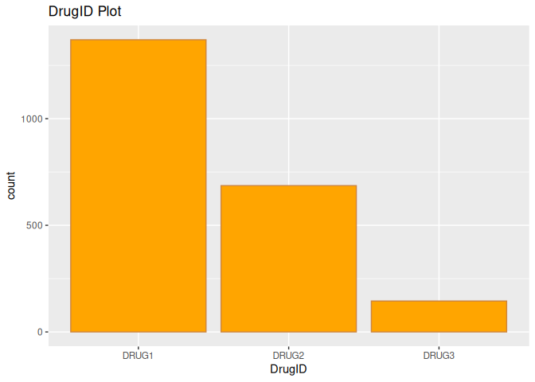
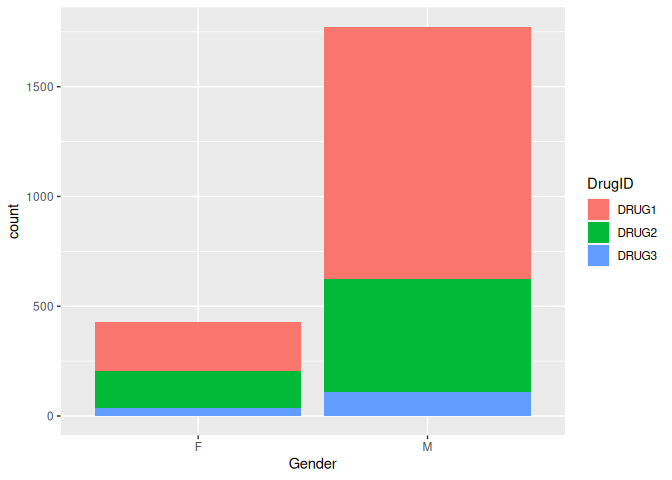
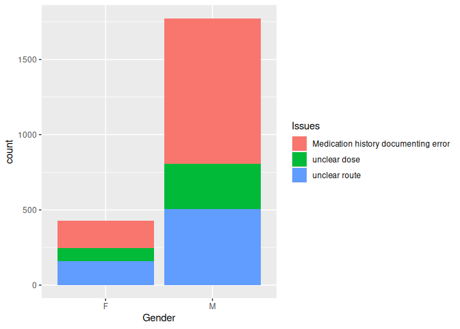
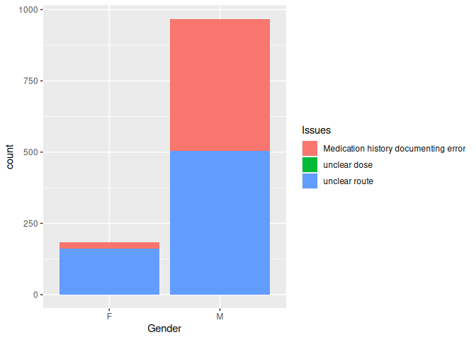
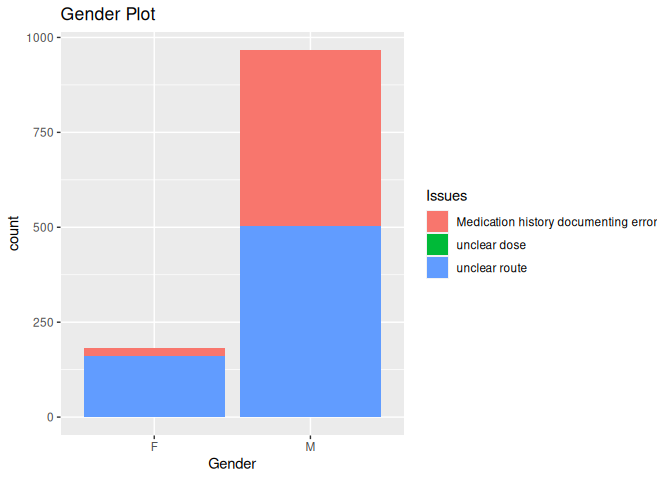

geom bar attribute
================
Monalisa Roy

### Read the data

``` r
pharma=read.csv("Pharmacovigilance_audit_Data.csv",stringsAsFactors = T)
View(pharma)
```

``` r
library(ggplot2)
```

### Building a bar_plot:

**Assign ’LocationID’column to x-axis**

``` r
ggplot(data = pharma,aes(x=LocationID))+geom_bar()
```

<!-- -->

**Assigning ‘Issues’ to the fill attribute**

``` r
ggplot(data = pharma,aes(x=LocationID,fill=Issues))+geom_bar()
```

<!-- -->

**Setting a title to ‘LocationID Plot’**

``` r
ggplot(data = pharma,aes(x=LocationID,fill=Issues))+geom_bar()+ggtitle( "LocationID Plot")
```

<!-- -->

### Building a bar-plot for the ‘DrugID’ column\*\*

**Assigning the fill color to be ‘orange’**

``` r
ggplot(data = pharma,aes(x=DrugID,))+geom_bar(fill="orange")
```

<!-- -->

**Assigning the boundary color to be ‘peru’**

``` r
ggplot(data = pharma,aes(x=DrugID))+geom_bar(fill="orange",col="peru")
```

<!-- -->

**Setting title to ‘DrugID Plot’**

``` r
ggplot(data = pharma,aes(x=DrugID))+geom_bar(fill="orange",col="peru")+ggtitle("DrugID Plot")
```

<!-- -->

### Building a bar-plot for the ’Gender’column assigned to x-axis.

**Assigning ‘DrugID’ to the fill aesthetic**

``` r
ggplot(data = pharma,aes(x=Gender,fill=DrugID))+geom_bar()
```

<!-- -->

**Assign ‘Issues’ to the fill aesthetic**

``` r
ggplot(data = pharma,aes(x=Gender,fill=Issues))+geom_bar()
```

<!-- -->

**Changing the position of the bars to ‘identity’**

``` r
ggplot(data = pharma,aes(x=Gender,fill=Issues))+geom_bar(position = "identity")
```

<!-- -->

**Setting title to ‘Gender Plot’**

``` r
ggplot(data = pharma,aes(x=Gender,fill=Issues))+geom_bar(position = "identity")+ggtitle("Gender Plot")
```

<!-- -->
