Geom box plot
================
Monalisa Roy

### Read the data, load libraries

``` r
placement=read.csv("Placement_Data_Full_Class.csv",stringsAsFactors = T)
library(ggplot2)
```

### Creating a box-plot between ‘etest_p’ & ‘workex’.Map ’etest_p’to the y-axis and workex to the x-axis.

``` r
ggplot(data = placement,aes(x=workex,y=etest_p))+geom_boxplot()
```

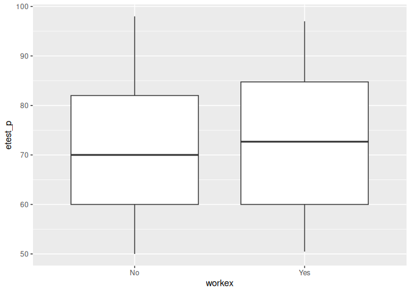<!-- -->

**Assigning it a fill color of ‘wheat3’**

``` r
ggplot(data = placement,aes(x=workex,y=etest_p))+geom_boxplot(fill="wheat3")
```

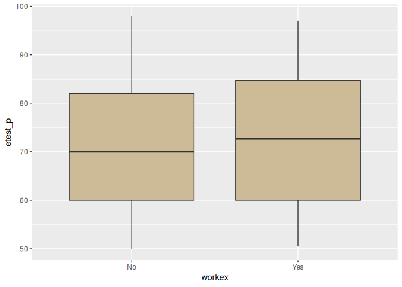<!-- -->

**Assigning it a boundary color of ‘snow3’**

``` r
ggplot(data = placement,aes(x=workex,y=etest_p))+geom_boxplot(fill="wheat3",col="snow3")
```

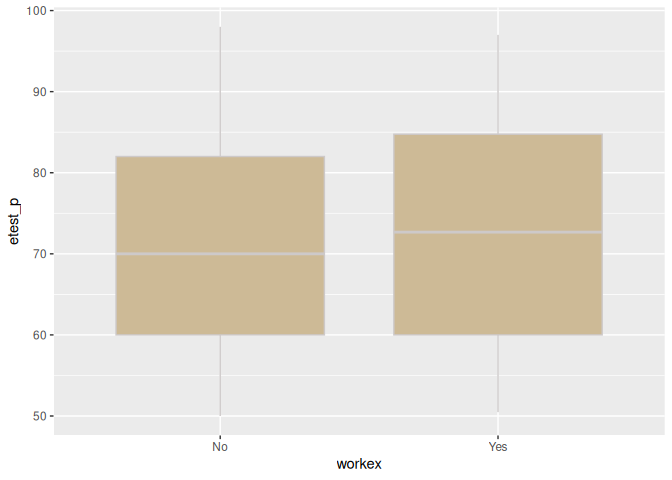<!-- -->

**Give a title as ‘E-test & Workex’**

``` r
ggplot(data = placement,aes(x=workex,y=etest_p))+geom_boxplot(fill="wheat3",col="snow3")+ggtitle("E-test & Workex")
```

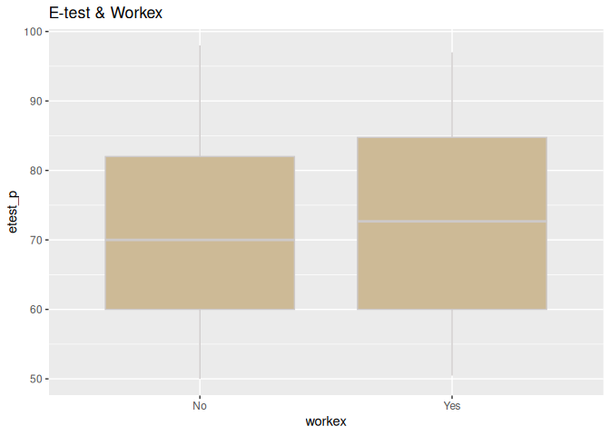<!-- -->

### Build a box-plot between ‘etest_p’& ‘gender’. Map ‘etest_p’to the y-axis and ’gender’ to the x-axis.

``` r
ggplot(data = placement,aes(x=gender,y=etest_p))+geom_boxplot()
```

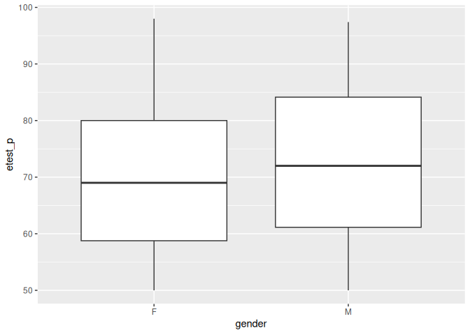<!-- -->

**Assigning ’degree_t’to the fill aesthetic**

``` r
ggplot(data = placement,aes(x=gender,y=etest_p,fill=degree_t))+geom_boxplot()
```

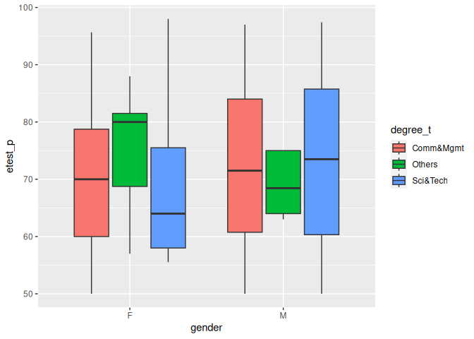<!-- -->

**Assign ’hsc_s’to the fill aesthetic**

``` r
ggplot(data = placement,aes(x=gender,y=etest_p,fill=hsc_s))+geom_boxplot()
```

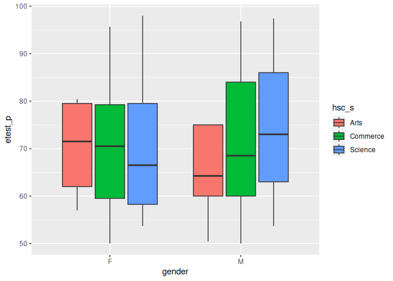<!-- -->

**Give a title as ‘E-test & Gender’**

``` r
ggplot(data = placement,aes(x=gender,y=etest_p,fill=hsc_s))+geom_boxplot()+ggtitle("E-test & Gender")
```

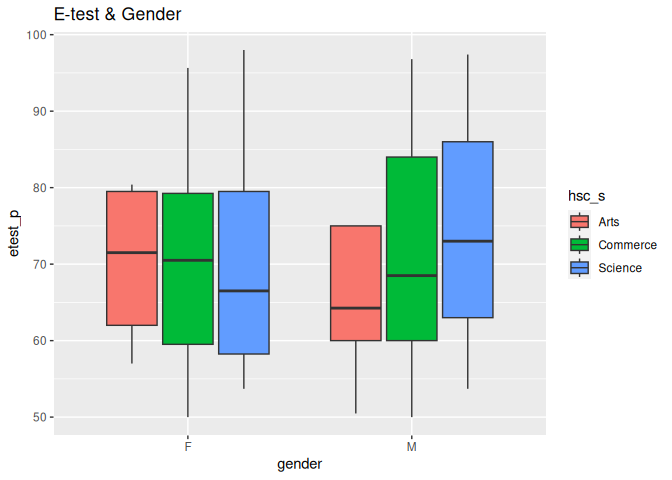<!-- -->

### Build a box-plot between ‘etest_p’& ‘specialisation’

``` r
ggplot(data = placement,aes(x=specialisation,y=etest_p))+geom_boxplot()
```

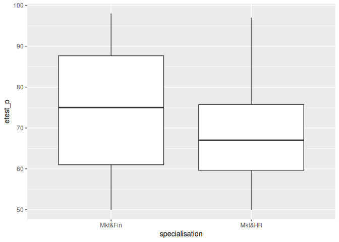<!-- -->

#Assigning ’ssc_b’to the fill aesthetic\*\*

``` r
ggplot(data = placement,aes(x=specialisation,y=etest_p,fill=ssc_b))+geom_boxplot()
```

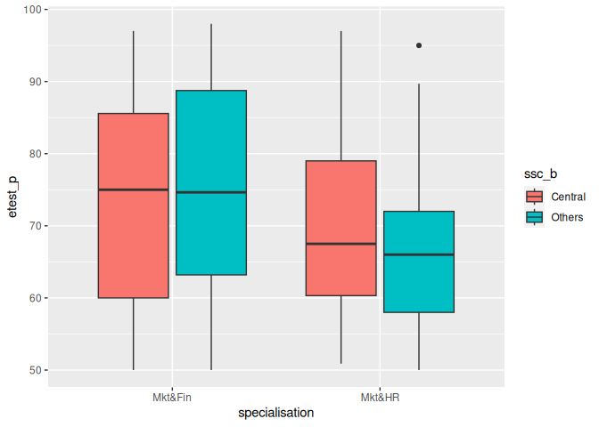<!-- -->

**Assigning ’hsc_b’to the fill aesthetic**

``` r
ggplot(data = placement,aes(x=specialisation,y=etest_p,fill=hsc_b))+geom_boxplot()
```

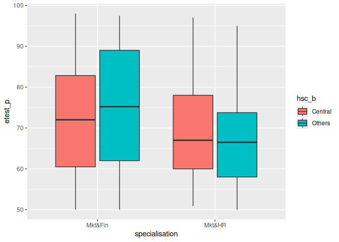<!-- -->

**Giving a title as ‘E-test & Specialisation’**

``` r
ggplot(data = placement,aes(x=specialisation,y=etest_p,fill=hsc_b))+geom_boxplot()+ggtitle("E-test & Specialisation")
```

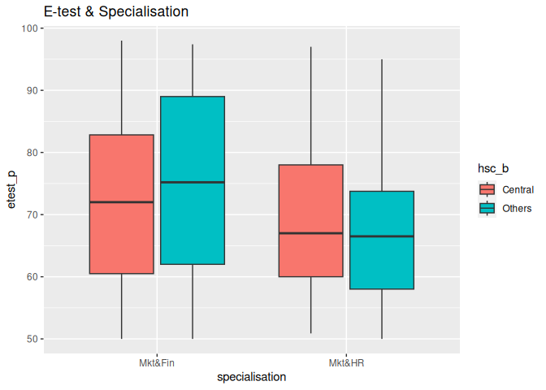<!-- -->
