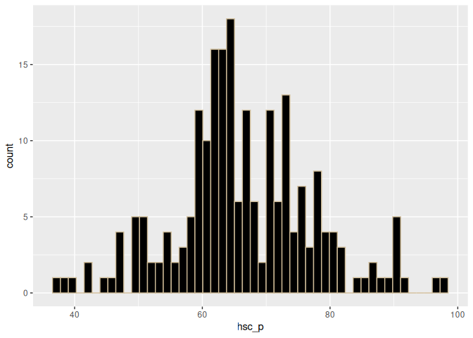

geom_histogram
================
Monalisa Roy

### Read the data, load libraries

``` r
placement=read.csv("Placement_Data_Full_Class.csv",stringsAsFactors = T)
library(ggplot2)
```

### Creating a histogram for ‘ssc_p’ column

``` r
ggplot(data = placement,aes(x=ssc_p))+geom_histogram()
```

    ## `stat_bin()` using `bins = 30`. Pick better value with `binwidth`.

<!-- -->

**Assigning a color ‘azure’ to the histogram**

``` r
ggplot(data = placement,aes(x=ssc_p))+geom_histogram(col="azure")
```

    ## `stat_bin()` using `bins = 30`. Pick better value with `binwidth`.

<!-- -->

**Changing number of bins to 50**

``` r
ggplot(data = placement,aes(x=ssc_p))+geom_histogram(bins=50,col="azure")
```

<!-- -->

**Assigning a color ‘cornsilk4’to the’fill’ attribute in geom_histogram
function**

``` r
ggplot(data = placement,aes(x=ssc_p))+geom_histogram(bins=50,col="azure",fill="cornsilk4")
```

<!-- -->

**Giving it a title**

``` r
ggplot(data = placement,aes(x=ssc_p))+geom_histogram(bins=50,col="azure",fill="cornsilk4")+ggtitle("SSC Percentage")
```

<!-- -->

### Creating a histogram for ‘hsc_p’

``` r
ggplot(data = placement,aes(x=hsc_p))+geom_histogram()
```

    ## `stat_bin()` using `bins = 30`. Pick better value with `binwidth`.

<!-- -->

**Assigning a color ‘wheat3’ to the histogram**

``` r
ggplot(data = placement,aes(x=hsc_p))+geom_histogram(col="wheat3")
```

    ## `stat_bin()` using `bins = 30`. Pick better value with `binwidth`.

<!-- -->

**Changing number of bins to 50**

``` r
ggplot(data = placement,aes(x=hsc_p))+geom_histogram(bins=50,col="wheat3")
```

<!-- -->

**Assigning a color ‘black’to the’fill’ attribute in geom_histogram
function**

``` r
ggplot(data = placement,aes(x=hsc_p))+geom_histogram(bins=50,fill="black",col="wheat3")
```

<!-- -->

**Giving it a title as ‘HSC Percentage’**

``` r
ggplot(data = placement,aes(x=hsc_p))+geom_histogram(bins=50,fill="black",col="wheat3")+ggtitle("HSC Percentage")
```

<!-- -->

### Creating a histogram as per the following condition

**Assigning ’degree_p’column to the x-axis**

``` r
ggplot(data = placement,aes(x=degree_p))+geom_histogram()
```

    ## `stat_bin()` using `bins = 30`. Pick better value with `binwidth`.

<!-- -->

**Setting the number of bins to 80**

``` r
ggplot(data = placement,aes(x=degree_p))+geom_histogram(bins=80)
```

<!-- -->

**Assigning a color ‘violet’ to the bars**

``` r
ggplot(data = placement,aes(x=degree_p))+geom_histogram(bins=80,col="violet")
```

<!-- -->

**Assigning a color ‘white’to the’fill’ attribute in geom_histogram
function**

``` r
ggplot(data = placement,aes(x=degree_p))+geom_histogram(bins=80,col="violet",fill="white")
```

<!-- -->

**Giving it a title ‘Degree Percentage’**

``` r
ggplot(data = placement,aes(x=degree_p))+geom_histogram(bins=80,col="violet",fill="white")+ggtitle("Degree Percentage")
```

<!-- -->

### Creating a histogram with condition

**Assign ’etest_p’column to the x-axis**

``` r
ggplot(data = placement,aes(x=etest_p))+geom_histogram()
```

    ## `stat_bin()` using `bins = 30`. Pick better value with `binwidth`.

<!-- -->

**Setting the number of bins to 100**

``` r
ggplot(data = placement,aes(x=etest_p))+geom_histogram(bins = 100)
```

<!-- -->

**Assigning a color ‘white’ to the bars**

``` r
ggplot(data = placement,aes(x=etest_p))+geom_histogram(bins = 100,col="white")
```

<!-- -->

**Assigning a color ‘black’to the’fill’ attribute in geom_histogram
function**

``` r
ggplot(data = placement,aes(x=etest_p))+geom_histogram(bins = 100,col="white",fill="black")
```

<!-- -->

**Giving it a title as ‘E_test Percentage’**

``` r
ggplot(data = placement,aes(x=etest_p))+geom_histogram(bins = 100,col="white",fill="black")+ggtitle("E-test Percentage")
```

<!-- -->
