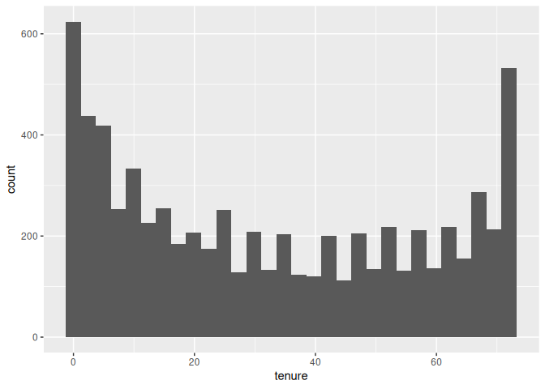
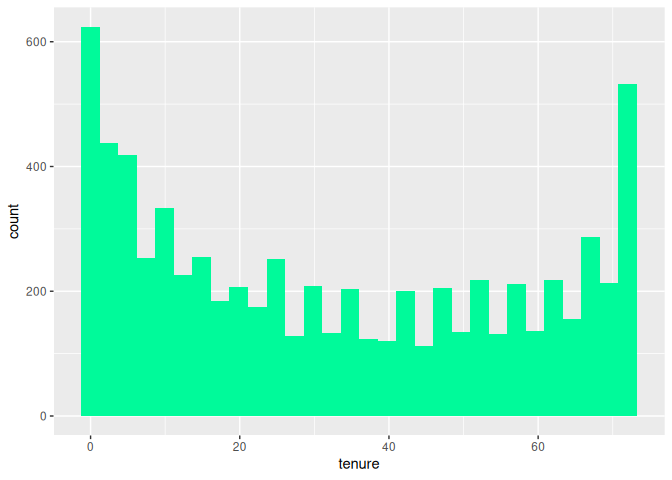
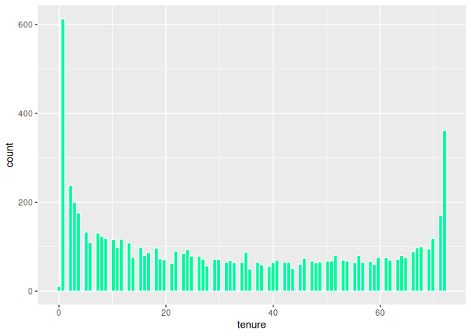
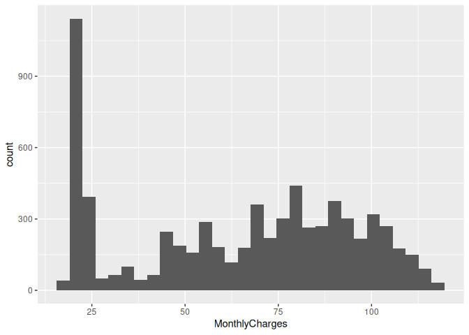
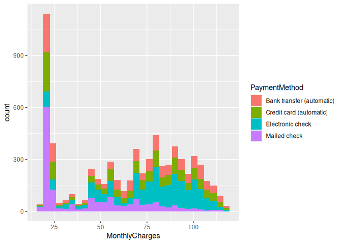
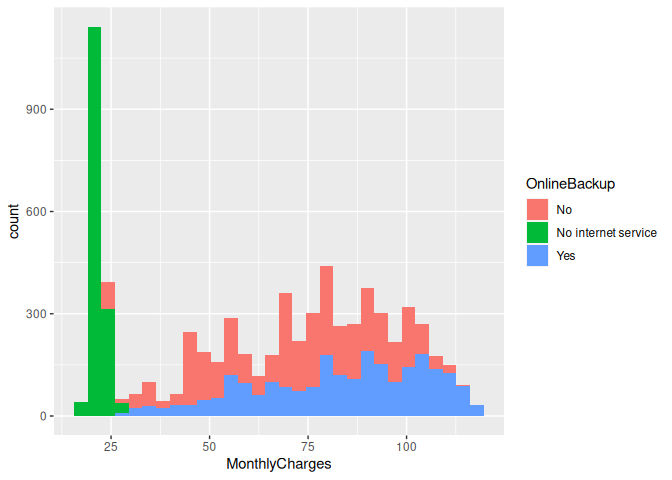
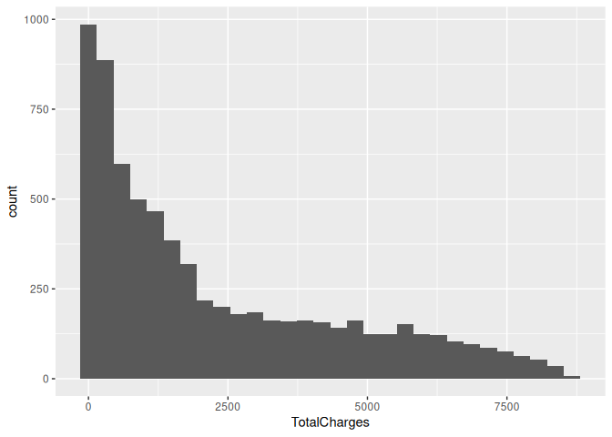
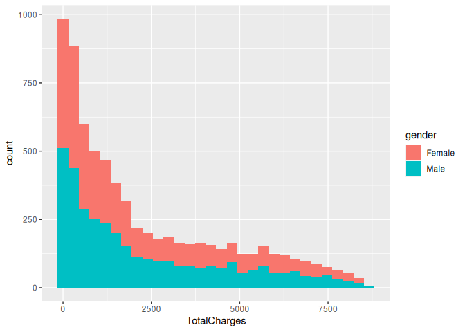
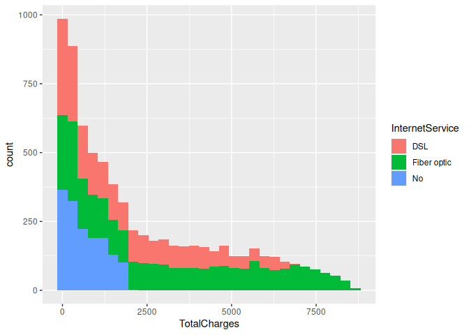

Data visualization – Histogram
================
Monalisa Roy

## Plotting histograms

``` r
customer=read.csv("customer-churn",stringsAsFactors = T)
View(customer)


library(ggplot2)
```

### Histogram for the’tenure’ column

``` r
ggplot(data = customer,aes(x=tenure))+geom_histogram()
```

    ## `stat_bin()` using `bins = 30`. Pick better value with `binwidth`.

<!-- -->

### Coloring with ‘mediumspringgreen’

``` r
ggplot(data = customer,aes(x=tenure))+geom_histogram(fill="mediumspringgreen")
```

    ## `stat_bin()` using `bins = 30`. Pick better value with `binwidth`.

<!-- -->

### Boundary color

``` r
ggplot(data = customer,aes(x=tenure))+geom_histogram(fill="mediumspringgreen",col="azure")
```

    ## `stat_bin()` using `bins = 30`. Pick better value with `binwidth`.

<!-- -->
### Altering the number of the bins to be 100.

``` r
ggplot(data = customer,aes(x=tenure))+geom_histogram(fill="mediumspringgreen",col="azure",bins = 100)
```

<!-- -->

### Histogram for the’MonthlyCharges’ column.

``` r
ggplot(data = customer,aes(x=MonthlyCharges))+geom_histogram()
```

    ## `stat_bin()` using `bins = 30`. Pick better value with `binwidth`.

<!-- -->

### ‘PaymentMethod’ to the fill aesthetic.

``` r
ggplot(data = customer,aes(x=MonthlyCharges,fill=PaymentMethod))+geom_histogram()
```

    ## `stat_bin()` using `bins = 30`. Pick better value with `binwidth`.

<!-- -->

### Assigning ‘OnlineBackup’ to the fill aesthetic.

``` r
ggplot(data = customer,aes(x=MonthlyCharges,fill=OnlineBackup))+geom_histogram()
```

    ## `stat_bin()` using `bins = 30`. Pick better value with `binwidth`.

<!-- -->

### Building a histogram for the ’TotalCharges’column

``` r
ggplot(data=customer,aes(x=TotalCharges))+geom_histogram()
```

    ## `stat_bin()` using `bins = 30`. Pick better value with `binwidth`.

    ## Warning: Removed 11 rows containing non-finite values (`stat_bin()`).

<!-- -->

### ‘gender’ to the fill aesthetic.

``` r
ggplot(data=customer,aes(x=TotalCharges,fill=gender))+geom_histogram()
```

    ## `stat_bin()` using `bins = 30`. Pick better value with `binwidth`.

    ## Warning: Removed 11 rows containing non-finite values (`stat_bin()`).

<!-- -->

### Assigning ‘InternetService’ to the fill aesthetic.

``` r
ggplot(data=customer,aes(x=TotalCharges,fill=InternetService))+geom_histogram()
```

    ## `stat_bin()` using `bins = 30`. Pick better value with `binwidth`.

    ## Warning: Removed 11 rows containing non-finite values (`stat_bin()`).

<!-- -->
