geom point attribute
================
Monalisa Roy

### Read the data, load libraries

``` r
placement=read.csv("Placement_Data_Full_Class.csv",stringsAsFactors = T)
library(ggplot2)
```

### Creating a scatter-plot

**Assigning ’hsc_p’column to x-axis and ’ssc_p’column to y-axis**

``` r
ggplot(data=placement,aes(x=hsc_p,y=ssc_p))+geom_point()
```

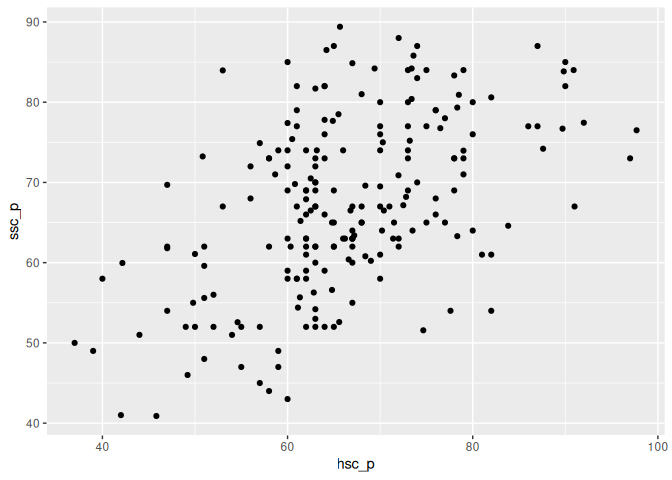<!-- -->

**Mapping ‘gender’ to col aesthetic**

``` r
ggplot(data=placement,aes(x=hsc_p,y=ssc_p,col=gender))+geom_point()
```

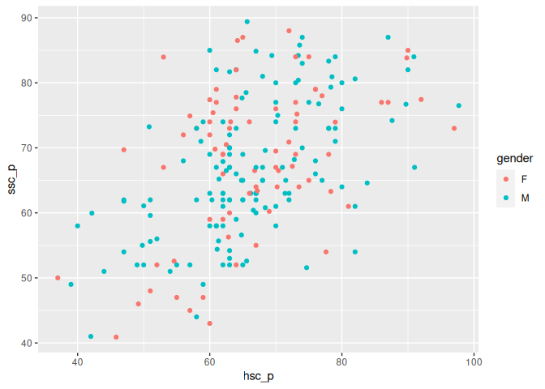<!-- -->

**Mapping ’workex’to col aesthetic**

``` r
ggplot(data=placement,aes(x=hsc_p,y=ssc_p,col=workex))+geom_point()
```

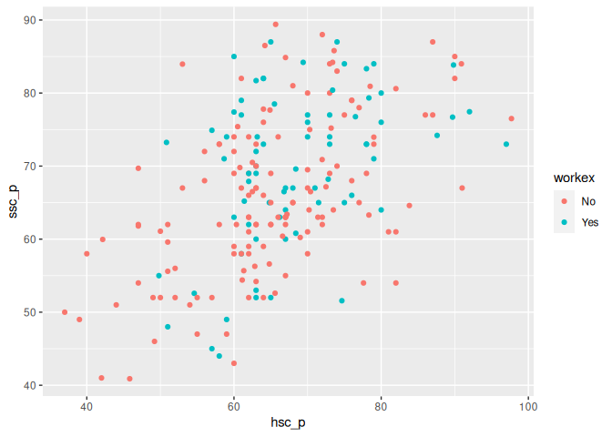<!-- -->

**Mapping ’status to col aesthetic**

``` r
ggplot(data=placement,aes(x=hsc_p,y=ssc_p,col=status))+geom_point()
```

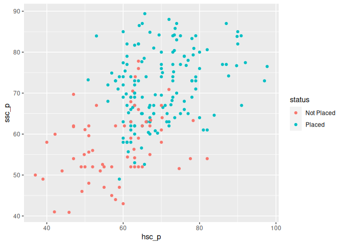<!-- -->

**Add a title to the plot as’Comparing HSC & SSC Percentage’**

``` r
ggplot(data=placement,aes(x=hsc_p,y=ssc_p,col=status))+geom_point()+ggtitle("Comparing HSC & SSC Percentage")
```

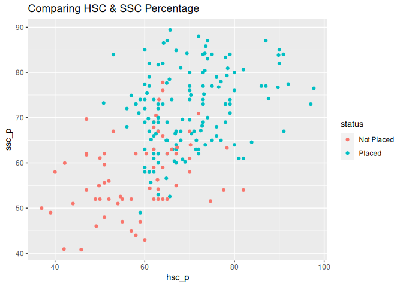<!-- -->

### Creating a scatter-plot\*\*

**Assigning ’degree_p’column to the x-axis and ’mba_p’column to the
y-axis.**

``` r
ggplot(data=placement,aes(x=degree_p,y=mba_p))+geom_point()
```

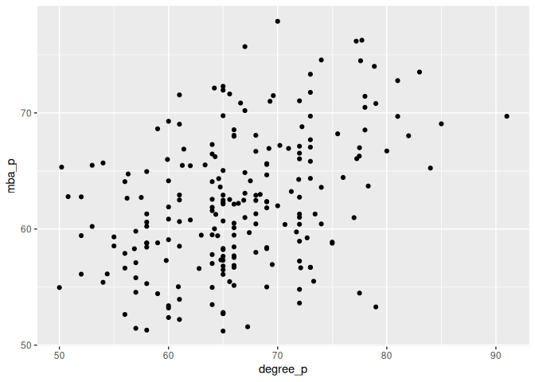<!-- -->

**Using ‘col’ as an aesthetic and assign it the column ‘status’**

``` r
ggplot(data=placement,aes(x=degree_p,y=mba_p,col=status))+geom_point()
```

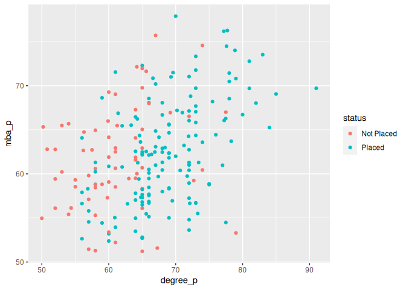<!-- -->

**Using ‘col’ as an aesthetic and assign it the column
‘specialisation’**

``` r
ggplot(data=placement,aes(x=degree_p,y=mba_p,col=specialisation))+geom_point()
```

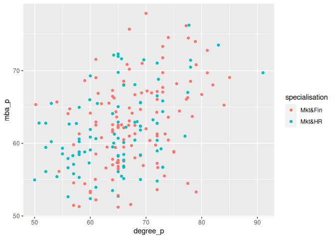<!-- -->

**Adding a title to the plot as ‘Understanding Degree & MBA
Percentage’**

``` r
ggplot(data=placement,aes(x=degree_p,y=mba_p,col=specialisation))+geom_point()+ggtitle("Understanding Degree & MBA Percentage")
```

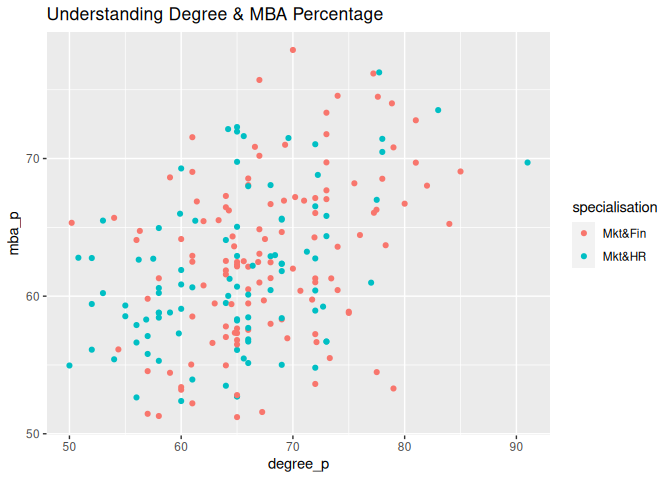<!-- -->

### Creating a scatter-plot:

**Assigning ’etest_p’column to the x-axis and ’salary’column to the
y-axis**

``` r
ggplot(data=placement,aes(x=etest_p,y=salary))+geom_point()
```

    ## Warning: Removed 67 rows containing missing values (`geom_point()`).

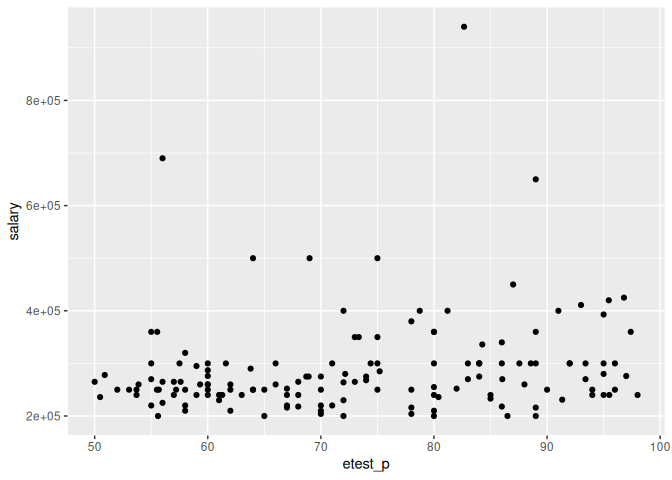<!-- -->

**Use ‘col’ as an aesthetic and assign it the column ‘workex’**

``` r
ggplot(data=placement,aes(x=degree_p,y=mba_p,col=workex))+geom_point()
```

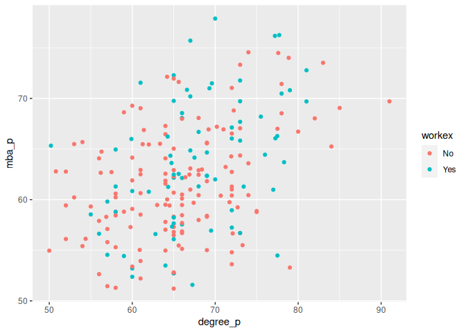<!-- -->

**Using ‘col’ as an aesthetic and assign it the column ‘gender’**

``` r
ggplot(data=placement,aes(x=degree_p,y=mba_p,col=gender))+geom_point()
```

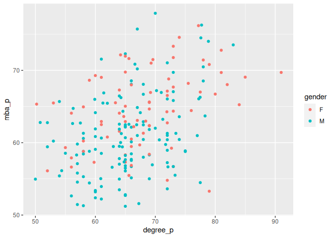<!-- -->

**Adding a title to the plot as’E-test & Salary’**

``` r
ggplot(data=placement,aes(x=degree_p,y=mba_p,col=gender))+geom_point()+ggtitle("E-test & Salary")
```

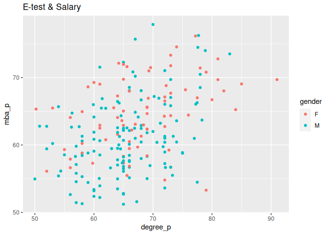<!-- -->
