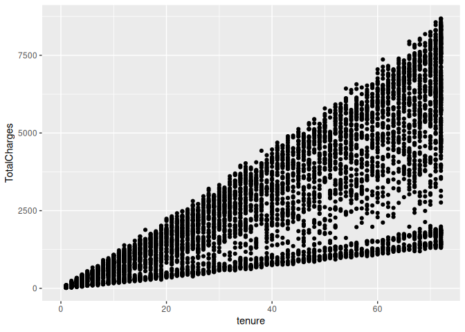
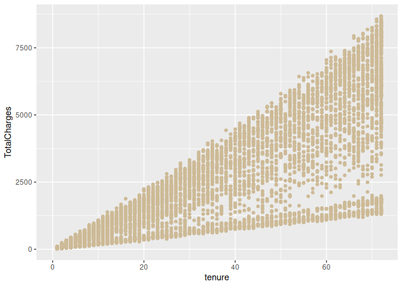
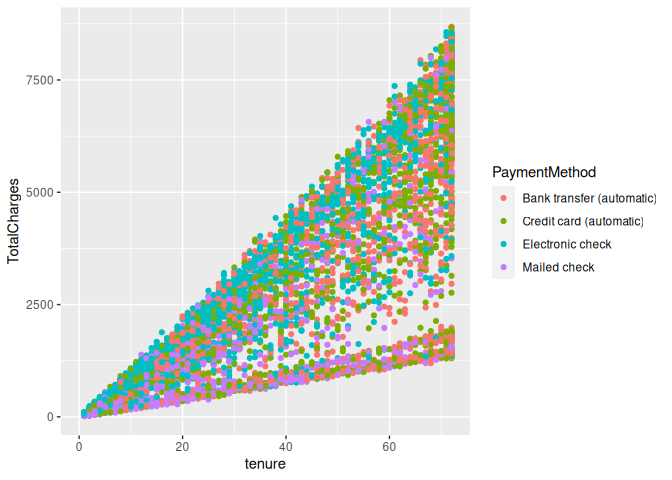
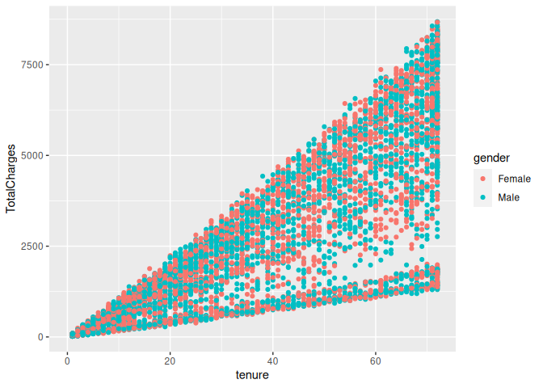
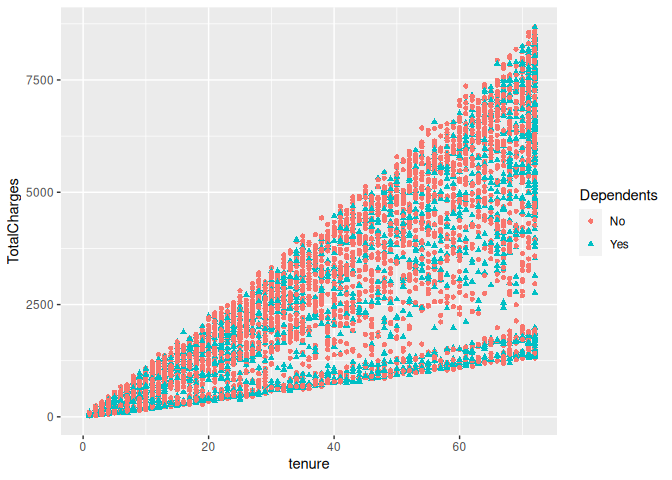
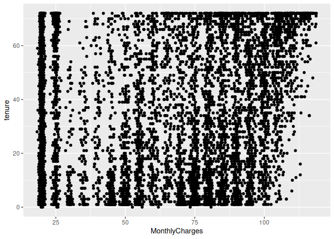
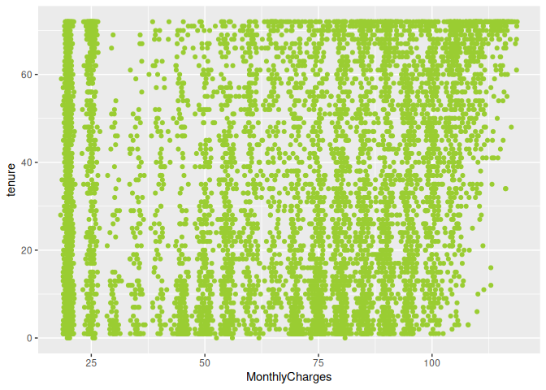
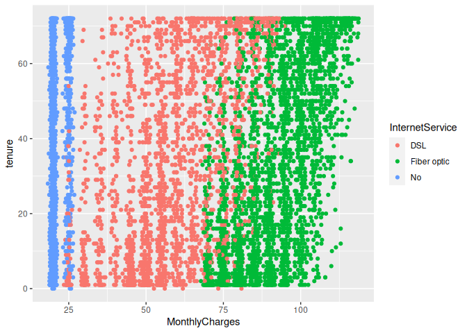
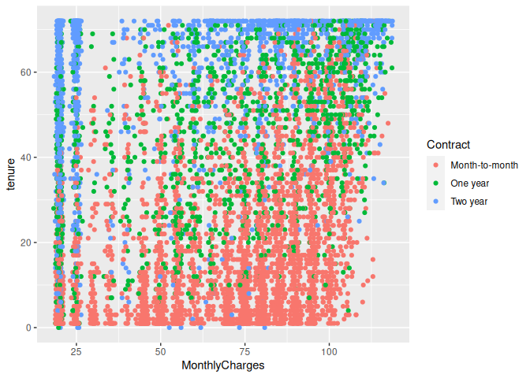

Data visualization – Geom_point function
================
Monalisa Roy

### Read the data

``` r
customer=read.csv("customer-churn",stringsAsFactors = T)
View(customer)

library(ggplot2)
```

### Building a scatter-plot between ‘TotalCharges’and ’tenure’.Map ’TotalCharges’to the y-axis and ’tenure’to the x-axis

``` r
ggplot(data = customer,aes(x=tenure,y=TotalCharges))+geom_point()
```

    ## Warning: Removed 11 rows containing missing values (`geom_point()`).

<!-- -->

### Assign it the color ‘wheat3’

``` r
ggplot(data = customer,aes(x=tenure,y=TotalCharges))+geom_point(col="wheat3")
```

    ## Warning: Removed 11 rows containing missing values (`geom_point()`).

<!-- -->

### Use ‘col’ as an aesthetic and map ’PaymentMethod’to col

``` r
ggplot(data = customer,aes(x=tenure,y=TotalCharges,col=PaymentMethod))+geom_point()
```

    ## Warning: Removed 11 rows containing missing values (`geom_point()`).

<!-- -->

###Use ‘col’ as an aesthetic and map ‘gender’ to col.

``` r
ggplot(data = customer,aes(x=tenure,y=TotalCharges,col=gender))+geom_point()
```

    ## Warning: Removed 11 rows containing missing values (`geom_point()`).

<!-- -->

###Map ‘Dependents’to both ’col’ and ’shape’aesthetics

``` r
ggplot(data = customer,aes(x=tenure,y=TotalCharges,col=Dependents,shape=Dependents))+geom_point()
```

    ## Warning: Removed 11 rows containing missing values (`geom_point()`).

<!-- -->

###.#Q1.Build a scatter-plot between ‘tenure’and ’MonthlyCharges’.Map
’tenure’to the y-axis and ’MonthlyCharges’to the x-axis

``` r
ggplot(data = customer,aes(x=MonthlyCharges, y=tenure))+geom_point()
```

<!-- -->

###.Assign the color ‘yellowgreen’.

``` r
ggplot(data = customer,aes(x=MonthlyCharges, y=tenure))+geom_point(col="yellowgreen")
```

<!-- -->

###.Use ‘col’ as an aesthetic and map ‘InternetService’ to col.

``` r
ggplot(data = customer,aes(x=MonthlyCharges, y=tenure,col=InternetService))+geom_point()
```

<!-- -->

###.Use ‘col’ as an aesthetic and map ‘Contract’ to col.

``` r
ggplot(data = customer,aes(x=MonthlyCharges, y=tenure,col=Contract))+geom_point()
```

<!-- -->
